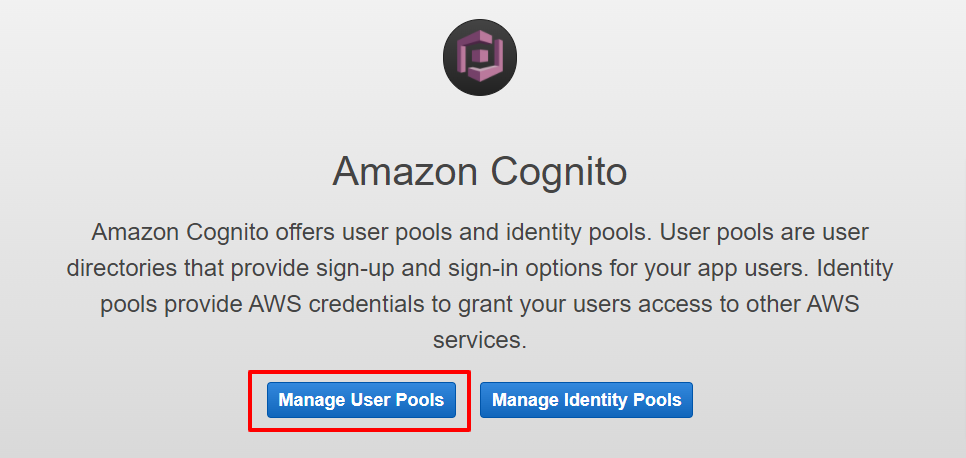
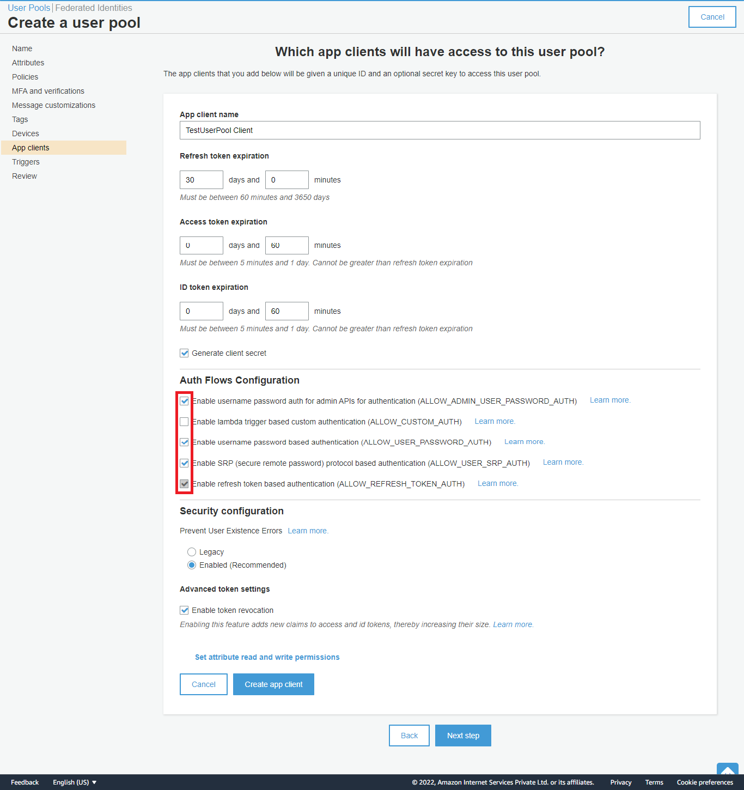
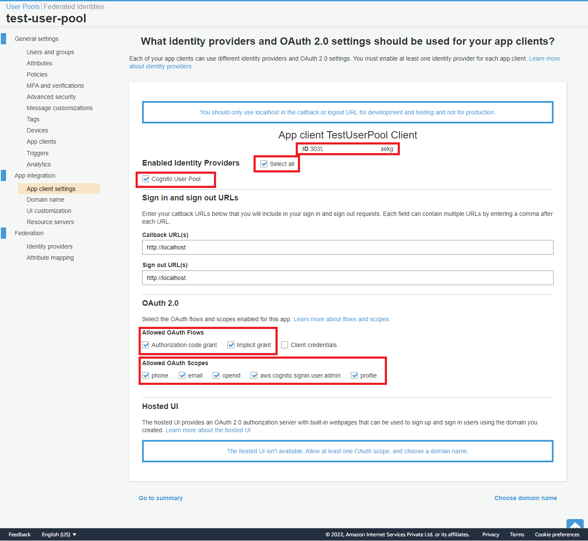
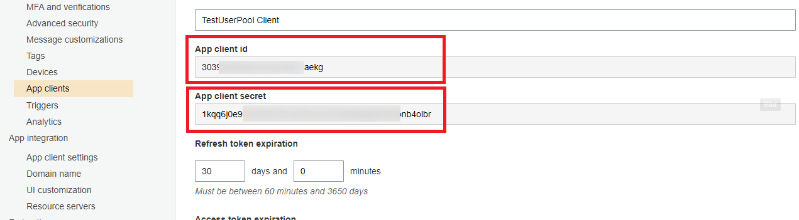
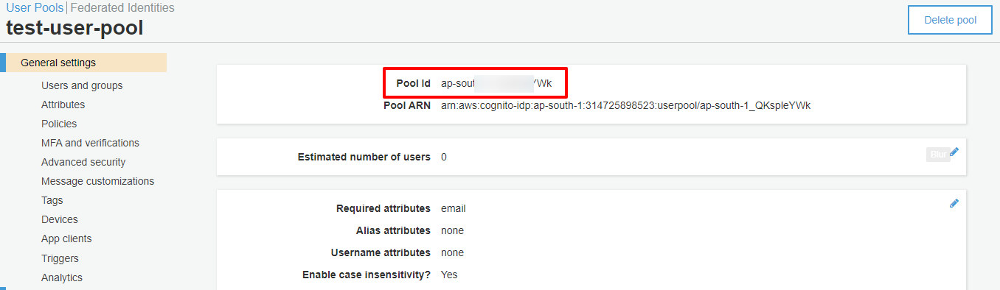

# Steps to setup the AWS Cognito
This document is shared for those requiring assistance or clarification in configuring the **AWS Cognito**. Make sure you have a valid **AWS account** and have successfully authenticated into it. Also the details of the **AWS IAM configuration** is not included here, and we expect that you know it.
  
------------
## Step 1: Select the User Pool

------------
## Step 2: Create the new pool

------------
## Step 3: Create the new pool

It is essential that the **ALLOW_ADMIN_USER_PASSWORD_AUTH** is selected.
------------
## Step 4: Create the App Client

Review the configurations as shown in the highlighted areas (Red Boxes) in the image above. Please also note the selections as shown for the OAuth Flows and Scopes.   
------------
## Step 5: Client Id and Client Secret

Please save these parameters. You will need to set them in the laravel environment file with the right keys. The key format is provided in the README file.  
------------
## Step 6: Pool Id

