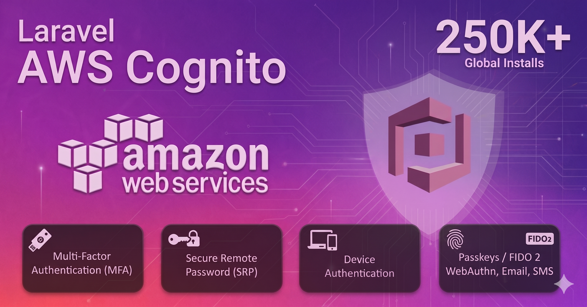

# Laravel Authentication using AWS Cognito

> [!NOTE]
> Updated On 2026-07-31

[](https://packagist.org/packages/ellaisys/aws-cognito#v1.1.3)&#160;
[](https://packagist.org/packages/ellaisys/aws-cognito)&#160;
[](https://packagist.org/packages/ellaisys/aws-cognito)&#160;

&#160;
&#160;
[](https://github.com/ellaisys/aws-cognito/graphs/contributors?all=1)&#160;
[](LICENSE.md)

[](https://sonarcloud.io/summary/new_code?id=ellaisys_aws-cognito)&#160;
[](https://sonarcloud.io/summary/new_code?id=ellaisys_aws-cognito)&#160;
[](https://sonarcloud.io/summary/new_code?id=ellaisys_aws-cognito)


## Contents

- [Introduction](#introduction)
    + [Demo Application & Code](#demo-application--code)
    + [Compatibility](#compatibility)
- [Features](#features)
- [Installation](#installation)
- [Quick Start & Configurations](./docs/README_CONFIG.md#contents)
- [References](#references)
- [Usage](#usage)
- [Code Quality](#code-quality)
- [Changelog](#changelog)
- [Security](#security)
- [Roadmap](#roadmap)
- [FAQs](./docs/FAQ.md)
- [Credits & Contributors](#credits--contributors)
    + [Contribute](#contribute)
- [Support Us](#support-us)
    + [Sponsor the Project](#sponsor-the-project)
- [License](#license)
- [Disclaimer](#disclaimer)


## Introduction

*This package provides native integration between Laravel's authentication system and Amazon Cognito. It supports session-based authentication for web applications, token-based authentication for APIs, Multi-Factor Authentication (MFA), SRP authentication, Passkeys (FIDO2/WebAuthn), and Device Authentication while allowing developers to continue using Laravel's familiar authentication features.*

It integrates AWS Cognito into Laravel's authentication ecosystem while preserving Laravel's native authentication experience.

This is built on top of the AWS Cognito SDK for PHP, to provide a simple and easy-to-use experience for interacting with the AWS Cognito service. The package provides a set of traits that can be used in your Laravel controllers to handle all the authentication-related features.

### *Demo Application & Code*

A complete demo application is available that demonstrates the package in a real Laravel application. It can be used as a reference implementation or as a starting point for your own projects.

The [demo application code](https://github.com/ellaisys/demo_cognito_app) is available on the GitHub and can be used as a reference for your own application.

### *Compatibility*

<table>
<tr><th><div align="center">PHP Support</div></th><th><div align="center">Laravel Support</div></th></tr>
<tr><td>

|Version|Support|
|-|-| 
|7.4|Yes :heavy_check_mark:|
|8.0|Yes :heavy_check_mark:|
|8.1|Yes :heavy_check_mark:|
|8.2|Yes :heavy_check_mark:|
|8.3|NA |
|8.4|NA |

</td><td>

|Version|Support|
|-|-|
|7.x|Yes :heavy_check_mark:|
|8.x|Yes :heavy_check_mark:|
|9.x|Yes :heavy_check_mark:|
|10.x|Yes :heavy_check_mark:|
|11.x|Yes :heavy_check_mark:|
|12.x|Yes :heavy_check_mark:|
|13.x|NA|

</td></tr> </table>


## Features

- Authentication
    - [Core IAM](./docs/README_CORE.md)
    
        |Supports|
        |-|
        | User Invitation & Registration :heavy_check_mark: |
        | User Verification :heavy_check_mark: |
        | User Login & Logout :heavy_check_mark: |
        | Forgot Password :heavy_check_mark: |
        | Password Reset :heavy_check_mark: |
        | Session Authentication :heavy_check_mark: |
        | API Authentication :heavy_check_mark: |
        | Laravel Guards :heavy_check_mark: |
        More

    - [SRP](./docs/README_SRP.md) ***New Feature***
    - [Remembered Devices](./docs/README_DEVICE_AUTH.md) ***New Feature***

- Security
    - [Multi-Factor Authentication (MFA)](./docs/README_MFA.md) ***Updated***
    - [FIDO2 Security Keys (Passkeys)](./docs/README_FIDO2.md) ***Updated***

- Laravel
    - [Preconfigured Routes and Controllers](./docs/README_ROUTES.md) ***Updated***


## Installation

This package is available via [Packagist](https://packagist.org/packages/ellaisys/aws-cognito) and can be installed using composer.

```sh
composer require ellaisys/aws-cognito
```

## Code Quality

This project follows secure coding and quality assurance practices throughout its development lifecycle. Automated static analysis is performed using SonarCloud to identify potential bugs, vulnerabilities, maintainability issues, and code smells before changes are merged.

In addition to automated analysis, all contributions are reviewed before being merged to help maintain the quality, reliability, and security of the project.


## Changelog

For a complete history of changes, improvements, bug fixes, and new features, please refer to the [CHANGELOG.md](CHANGELOG.md).


## Security

The security of this project and its users is important to us. If you discover or suspect a security vulnerability, please follow our responsible disclosure process described in [SECURITY.md](SECURITY.md).

We kindly ask that you **do not report security vulnerabilities through public GitHub issues**.


## Roadmap

Our development roadmap, planned features, and future enhancements are maintained on the project's GitHub Projects and Wiki.

- [GitHub Project Board](https://github.com/orgs/ellaisys/projects/2)
- [Project Wiki Roadmap](https://github.com/ellaisys/aws-cognito/wiki/RoadMap)


## Credits & Contributors


This project has been inspired by the work of the open-source community. We are grateful to the developers and maintainers whose ideas, discussions, libraries, and code have helped influence the design and implementation of this package.

We would like to acknowledge the following projects and organizations for their inspiration, technical references, or contributions. Portions of this project were adapted from the following open-source projects in accordance with their respective licenses:

* **Pod-Point** – https://github.com/Pod-Point
* **black-bits/laravel-cognito-auth** – https://github.com/black-bits/laravel-cognito-auth
* **tymondesigns/jwt-auth** – https://github.com/tymondesigns/jwt-auth

Special thanks to everyone who has contributed their time, expertise, and feedback to help improve this project.

* **EllaiSys Team** – https://github.com/ellaisys
* **Project Contributors** – https://github.com/ellaisys/aws-cognito/graphs/contributors

### *Contribute*

Open source thrives because of its community. Whether you're fixing bugs, improving documentation, reviewing code, suggesting new features, or helping other users, every contribution is valued and appreciated.

If you'd like to get involved, explore the contribution badges below to find ways you can help.

<div align="center" markdown="1">

[](https://github.com/ellaisys/aws-cognito/issues)&#160;
[](https://github.com/ellaisys/aws-cognito/issues?q=is%3Aopen+is%3Aissue+label%3A%22good+first+issue%22)&#160;
[](https://github.com/ellaisys/aws-cognito/issues?q=is%3Aopen+is%3Aissue+label%3A%22help+wanted%22)    
[](https://github.com/ellaisys/aws-cognito/pulls)&#160;
[](https://github.com/ellaisys/aws-cognito/pulls?q=is%3Apr+is%3Amerged)&#160;
[](https://github.com/ellaisys/aws-cognito/pulls?q=is%3Aopen+is%3Aissue+label%3A%22help+wanted%22)

</div>


## Support Us

EllaiSys was a web engineering and technology consulting company specializing in Cloud Computing (AWS and Azure), DevOps, Identity and Access Management (IAM), and Product Engineering. Although we concluded our professional services business in October 2021, we remain committed to maintaining and improving our open-source projects for the benefit of the community.

If this project has been helpful to you or your organization, we'd love your support. There are several ways you can contribute:

* **Give some love** by starring the repository on GitHub, sharing it with your network, or recommending it to others.
* **Spread the word** by writing blog posts, creating tutorials, or giving talks about the project.
* **Contribute code** by fixing bugs, implementing new features, or improving performance.
* **Report issues** and help us identify bugs or edge cases.
* **Improve the documentation** by correcting errors, adding examples, or enhancing clarity.
* **Share ideas** by suggesting new features or improvements.
* **Help others** by answering questions and participating in community discussions.
* **Spread the word** by starring the repository, sharing it with your network, or recommending it to others.

### *Sponsor the Project*

Maintaining a high-quality open-source project requires a significant investment of time and effort. If you'd like to support its continued development financially, your sponsorship is greatly appreciated. Every contribution—regardless of size—helps us dedicate more time to maintaining the project, fixing issues, implementing new features, and improving the documentation.

Whether you contribute your time, expertise, or financial support, thank you for helping us build better software for the community.


## License

This package is open-source software released under the MIT License.

The source code is available on GitHub and may be used, copied, modified, merged, published, distributed, sublicensed, and/or sold in accordance with the terms of the MIT License.

A copy of the license is included with this package in the [License](LICENSE.md) file. Please review the license before using, modifying, or redistributing this software.


## Disclaimer

This package is actively maintained and continuously improved.

We welcome bug reports, feature requests, and other feedback from the community. While we will make every reasonable effort to review and address reported issues, support is provided on a voluntary, best-effort basis. As this is an open-source project offered free of charge, we are unable to guarantee response times, issue resolution, or support service level agreements (SLAs).
