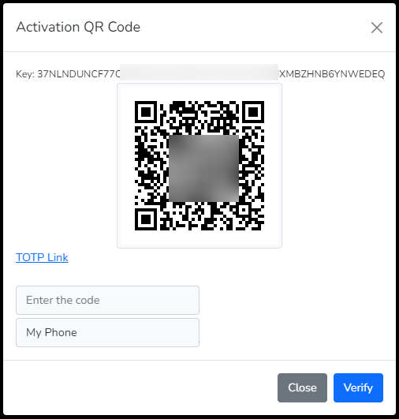

## **MFA Functionality**
The library currently provides the MFA for the Software Token and SMS based TOPT.

## **Configurations**
The package provides a trait that you can add to your controller to make the MFA methods running.
- Ellaisys\Cognito\Auth\RegisterMFA

Also, configure below keys into the .env file to change the default setting. 
 - The **AWS_COGNITO_MFA_SETUP** should be set to MFA_ENABLED to enable the MFA feature. The default value is MFA_NONE resulting into disabled MFA functionality. 
 - The **AWS_COGNITO_MFA_TYPE** can have values SOFTWARE_TOKEN_MFA (default) for the Software Token and SMS_MFA for the SMS based TOTP.

   The provider configuration to send out the SMS needs to be carried out in AWS and costs additional as per the AWS SNS pricing. For more details refer this [AWS link](https://aws.amazon.com/sns/sms-pricing/)

```php

    AWS_COGNITO_MFA_SETUP="MFA_ENABLED"
    AWS_COGNITO_MFA_TYPE="SOFTWARE_TOKEN_MFA"

```

## **Features**
- [Login (MFA Enabled)](#login)
- [Activate MFA](#activate-mfa-software-token-only)
- [Verify MFA Token](#verify-mfa-software-token-only)
- [Deactivate MFA](#deactivate-mfa-software-token-only)
- [Enable MFA](#enabledisable-mfa)
- [Disable MFA](#enabledisable-mfa)

### **Login**
The login shall require two steps for implementation of the overall authentication using the MFA approach. The first step shall generate the challenge, identified as a session token. The second step involves the OTP/TOTP code against that session token.

#### API based Approach
The first step API is common for the MFA enabled / disabled implementation.

```php

    public function actionLogin(Request $request)
    {
        //Create credentials object
        $collection = collect($request->all());

        if ($claim = $this->attemptLogin($collection, 'api', 'username', 'password', true)) {

            if ($claim instanceof AwsCognitoClaim) {
                return $claim->getData();
            } else {
                return $claim;
            } //End if
        }
    } //Function ends

```
If the MFA is disabled, the response shall have the access token, refresh token and the id token.
```json

```

In case the MFA is enabled and activated, then the response will be as shown below.
```json
    {
        "status": "SOFTWARE_TOKEN_MFA",
        "session": "AYABeEkKMeJKkzhx3MK-GzS3ISIAH
        QABAAdTZXJ2aWNlABBDb2duaXRvVXNlclBvb2xzAA
        ...
        ...
        jVrz53Y1uJ3I30w46CpL9xlB50IbVJ0SNYY_tuFsLc
        GjYfDpn7XQcd6-fXWovCIYoMH5Q"
    }
```

#### Web Application Approach
The first step for the web application is same for MFA enabled / disabled implementation. However now you can use the provided blade components to accept the SMS TOTP or Software Token code.

```html
    @extends('layouts.app')

    @section('content')
        <div class="container">
            @if (!((request()->has('status')) && (request()->has('session_token'))))
            <div class="row justify-content-center">
                <!-- Write your login page here -->
            </div>
            @endif

            <!-- Below is the blade component view -->
            <x-cognito::mfa.code />

        </div>
    @endsection
```

### **Activate MFA (Software Token Only)**
The activate process allows the user to configure the Software MFA. To configure the Software Token MFA setting on the mobile device, a key or the scan code (easy to consume), is available for use on any of the authenticator applications (i.e. Google Authentictor OR Microsoft Authenticator).

The process completes when the code is verified using the [Verified MFA](#verify-mfa-software-token-only) step.

#### Web and API based Approach
The function call looks as shown below. Just reference the the method activateMFA, with the guard name as a parameter, in the trait that you added above in configuration. This shall activate the Software MFA token.

```php

    public function actionActivate()
    {
	try {
            return $this->activateMFA('api'); //Pass the guard name for web/api calls
        } catch(Exception $e) {
			throw $e;
        } //Try-catch ends
    } //Function ends

```
The response that you will get for the API call would look this

```json
    {
        "SecretCode": "ESKPE46WBNOAB7QXXXXXXXXXXXXXXXXXXXPFIVJVJFEPDP2NNIA",
        "SecretCodeQR": "https://chart.googleapis.com/chart?chs=200x200&cht=qr&chl=otpauth://totp/ApplicationName (john@doe.com)?secret=ESKPE46WBNOAB7QXXXXXXXXXXXXXXXXXXXPFIVJVJFEPDP2NNIA&issuer=ApplicationName&choe=UTF-8",
        "TotpUri": "otpauth://totp/ApplicationName (john@doe.com)?secret=ESKPE46WBNOAB7QXXXXXXXXXXXXXXXXXXXPFIVJVJFEPDP2NNIA&issuer=ApplicationName"
    }
```

and the web response, you can design a page like this to show the code for activating the Software MFA token.



### **Verify MFA (Software Token Only)**
In order to complete the activation process, the verification is an essential step. As part of this verification process, you need to enter the code (available in the authenticator application) while submitting the request. The implementation needs to be updated depending on the web or API controller. The response will be HTTP Status Code 200.

```php

    public function actionVerify(string $code)
    {
	try {
            return $this->verifyMFA('api', $code); //Pass the guard name for web/api calls and the MFA code from the device
        } catch(Exception $e) {
			throw $e;
        } //Try-catch ends
    } //Function ends

```


### **Deactivate MFA (Software Token Only)**
In order to deactivate the MFA for a user, this process can be called to deactivate the MFA. In most practical situations, you can skip this implementation. This uses the access token for deactivation.

In order to enable/disable another user based on your RBAC implementation, you can use the [Enable/Diable Feature](#enabledisable-mfa)

```php

    public function actionDeactivateMFA()
    {
	try {
            return $this->deactivateMFA('api'); //Pass the guard name for web/api calls
        } catch(Exception $e) {
			throw $e;
        } //Try-catch ends
    } //Function ends

```

### **Enable/Disable MFA**
This feature allows the admin user to enable/disable a user's MFA (both Software Token and SMS) using an email address. The developer must implement the RBAC to ensure this feature is not misused.

Below methods in the trait help to enable or disable the MFA returning the HTTP Success Code.

```php

    public function actionEnableMFA(Request $request, string $userEmail)
    {
	try {
            $return $this->enableMFA('web', $userEmail); //Pass the guard name for web/api calls
        } catch(Exception $e) {
			throw $e;
        } //Try-catch ends
    } //Function ends


    public function actionDisableMFA(Request $request, string $userEmail)
    {
	try {
            $return $this->disableMFA('web', $userEmail); //Pass the guard name for web/api calls
        } catch(Exception $e) {
			throw $e;
        } //Try-catch ends
    } //Function ends

```

