# AWS Configurations

> [!NOTE]
> Last Updated: <!-- AUTO:last_updated -->2026-07-27<!-- /AUTO:last_updated -->

This document provides guidance on configuring AWS services, specifically AWS Cognito. Ensure you have the necessary permissions and knowledge to perform these configurations.


## Contents
- [AWS IAM configuration](#aws-iam-configuration)
- [AWS Cognito configuration](#aws-cognito-configuration)
- [References](#references)


## AWS IAM Configuration

Before using this package, you must create an **AWS IAM user** and **IAM role** with permissions to manage and interact with Amazon Cognito resources.

The IAM identity must have the following AWS managed policies attached:

* `AmazonCognitoDeveloperAuthenticatedIdentities`
* `AmazonCognitoPowerUser`
* `AmazonESCognitoAccess`

> **Note**
> Follow the principle of least privilege whenever possible. In production environments, consider creating a custom IAM policy that grants only the permissions required by your application instead of using broad managed policies.

Once the IAM user has been created, generate an **Access Key** for programmatic access. Add the generated credentials to your Laravel application's `.env` file:

```env
AWS_ACCESS_KEY_ID=your-access-key-id
AWS_SECRET_ACCESS_KEY=your-secret-access-key
```

These credentials are used by the AWS SDK to authenticate requests made by the package to your Amazon Cognito resources.

Refer the below image for the IAM user creation, role assignment process and creating the access key for programmatic access. Make sure to download the access key file and store it securely, as it will not be retrievable again from the AWS console.

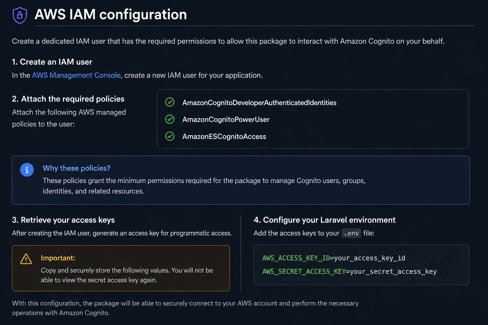


## AWS Cognito configuration

This document is shared for those requiring assistance or clarification in configuring the **AWS Cognito**. Make sure you have a valid **AWS account** and have successfully authenticated into it.

This document is intended to provide guidance on configuring AWS Cognito for your application. It is not a comprehensive guide to all AWS Cognito features, but rather focuses on the essential steps needed to set up a user pool and app client for your application.

AWS Cognito is a AWS service that provides authentication, authorization, and user management for web and mobile applications. It allows you to add user sign-up, sign-in, and access control to your web and mobile applications quickly and easily.

AWS Cognito provides Amplify SDKs for JavaScript, iOS, and Android that make it easy to integrate authentication into your applications. It also provides a web-based user interface for managing users and groups, as well as a REST API for programmatic access.

Any additional configurations or customizations that are required for your specific application should be done based on your application's requirements and AWS Cognito documentation.

In case of MFA (Multi-Factor Authentication), SRP, Device Authentication requirements, please refer to the configuration settings in respective sections of the AWS Cognito documentation.

> [!TIP]
> Focus on the sections highlighted in **RED** and **YELLOW** boxes. These are for modification and attention, respectively. The other sections are for your information only.

### *Step 1: AWS Cognito Service*

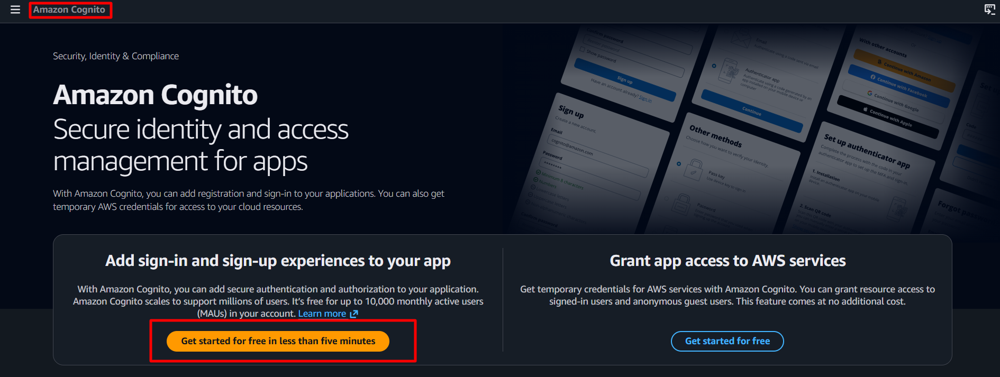


### *Step 2: Create the New User Pool*

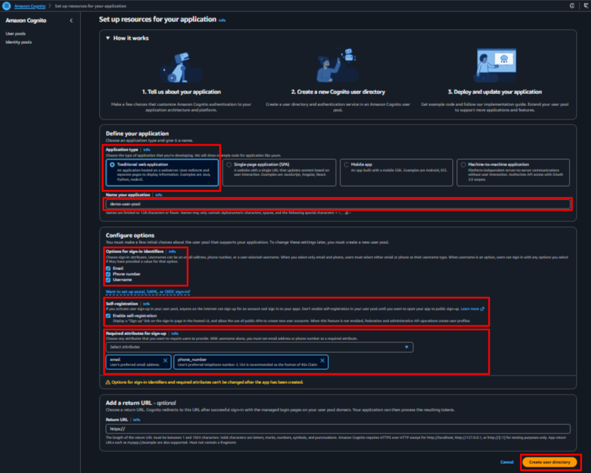

During the creation of the new user pool, you will be asked to provide a **Application Name** (Client Name). Please provide a name that is relevant to your application. AWS will automatically generate a **Pool Name** and you can also modify the **Pool Name** while amending the pool settings.

While creating the new user pool, you will be asked to select the **Configure Options**. Please select the options that are relevant to your application.

Enable **Self Registration** if you want your users to be able to register themselves. If you do not enable this option, then the users will have to be created by an administrator by inviting them to the application. You can also enable **Email Verification** if you want your users to verify their email addresses.


### *Step 3: New User Pool Created*

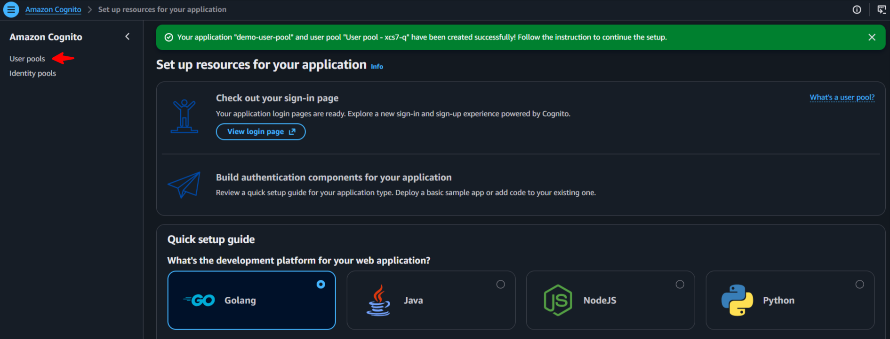

Once the new user pool is created, navigate by selecting the **User pools** from the left menu and select the newly created user pool.


### *Step 4: User Pool Overview*

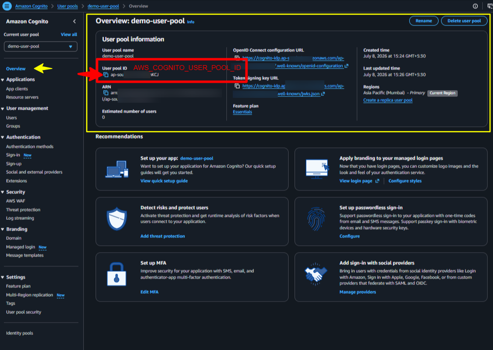

By selecting the **Overview** from the left menu, you will be able to see the **Pool Id** and **Pool ARN**. Please save these parameters.

The **Pool Id** will be used in the laravel environment file as `AWS_COGNITO_POOL_ID` value.

Select the **App clients** from the left menu, under the **Application** section. It will show a list of the app clients. Select the app client that you created in the previous step.


### *Step 5: App Client Overview*

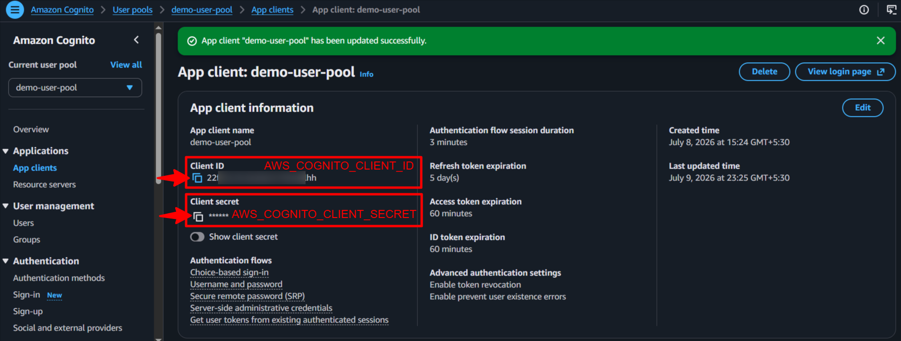

This page will show the **Client Id** and **Client Secret**.
Please save these parameters. You will need to set them in the laravel environment file to reference `AWS_COGNITO_CLIENT_ID` and `AWS_COGNITO_CLIENT_SECRET` values.

You can copy the values by clicking the blue copy icon next to the values (highlighted by the red arrow).


### *Step 6: Edit App Client Settings*

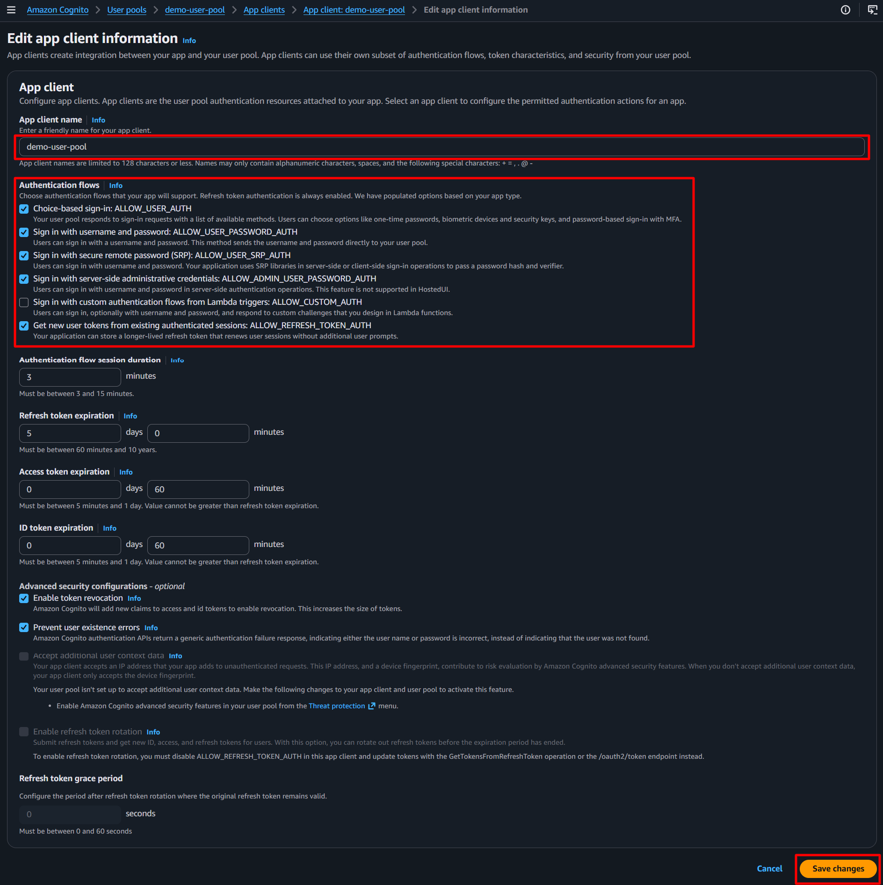

You can amend the **App Client Name** to a more relevant name if you wish.

In the **Authentication Flows** section, please select the following:
- `ALLOW_ADMIN_USER_PASSWORD_AUTH` (Essential for admin endpoints)
- `ALLOW_USER_PASSWORD_AUTH` (User authentication with username and password)
- `ALLOW_REFRESH_TOKEN_AUTH` (Required for refresh token)

Optionally, you can select the following, based on your application requirements:
- `ALLOW_USER_SRP_AUTH` (User authentication with SRP)
- `ALLOW_USER_AUTH` (Passwordless authentication)

Adjust the attributes below based on your application requirements, or leave them as default.

Save the changes by clicking the **Save Changes** button at the bottom of the page.


### *Step 7: Review and Amend Login Page Settings*

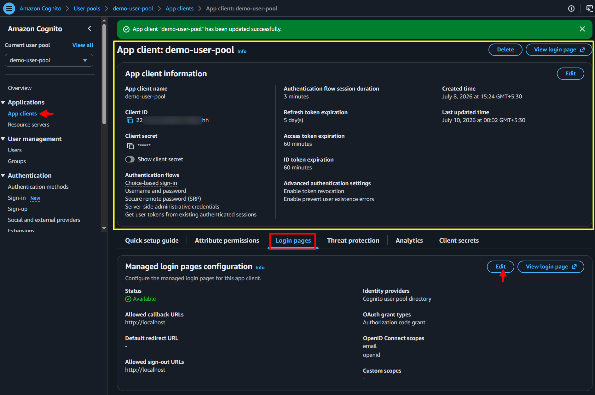

In the **App client** overview page, select the **Login page** from the tab below the overview section, as shown in the image above. Click the **Edit** button to amend the settings.


### *Step 8: Login Page Settings*

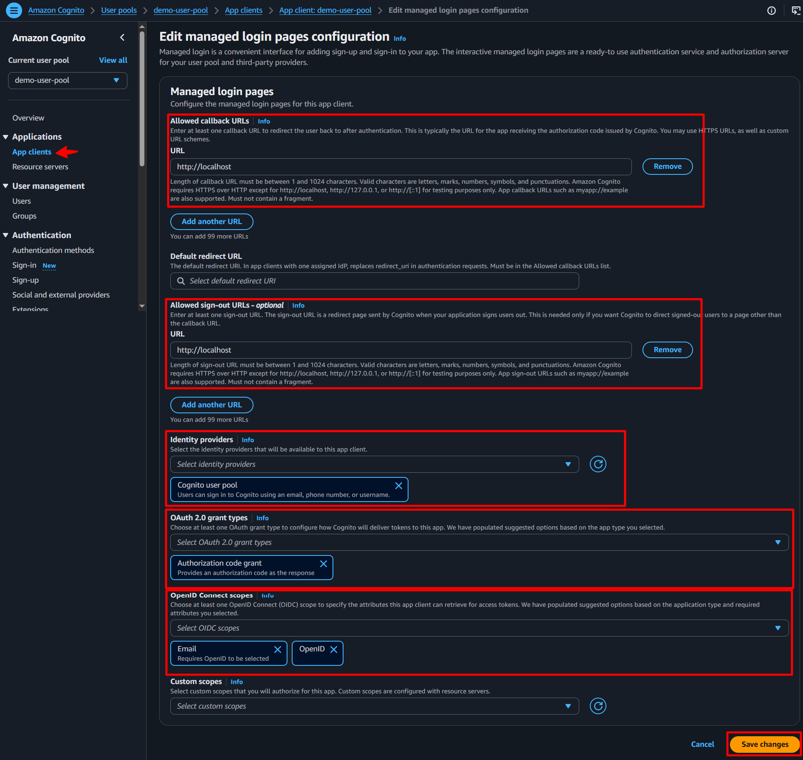

You can update the values as shown in the image above. Please ensure that you have selected the correct **Callback URL(s)** and **Sign out URL(s)**. These URLs are important for your application to redirect users after login and logout.

> [!NOTE]
> In development environments, you can use `http://localhost` as the **Callback URL** and `http://localhost` as the **Sign out URL**.

Select the **Identity Providers** dropdown and ensure that the **Cognito User Pool** is selected. You can also select other identity providers if you have configured them.

Select the **OAuth 2.0 Grant Types** dropdown and ensure that the **Authorization code grant** is selected.

In the **OpenID Connect** (OIDC) scopes section, ensure that the following scopes are selected:
- `email`
- `openid`

Save the changes by clicking the **Save Changes** button at the bottom of the page.


### *Step 9: User Group Management* (Optional)

AWS Cognito allows you to create user groups to manage users with similar access levels or roles. This step is optional and can be skipped if you do not require user groups. The package allows, users to be mapped to groups for easier management. If you want to create user groups, follow the steps below:

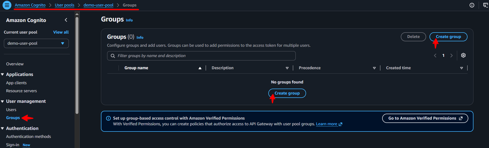

Navigate to the **User groups** section from the left menu and click on the **Create group** button. Provide a name for the group and configure any additional settings as required. Save the group.

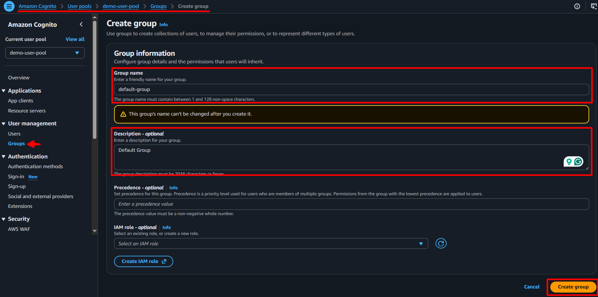

Enter the group name, description and click on the **Create group** button. You can create multiple groups as per your application requirements.

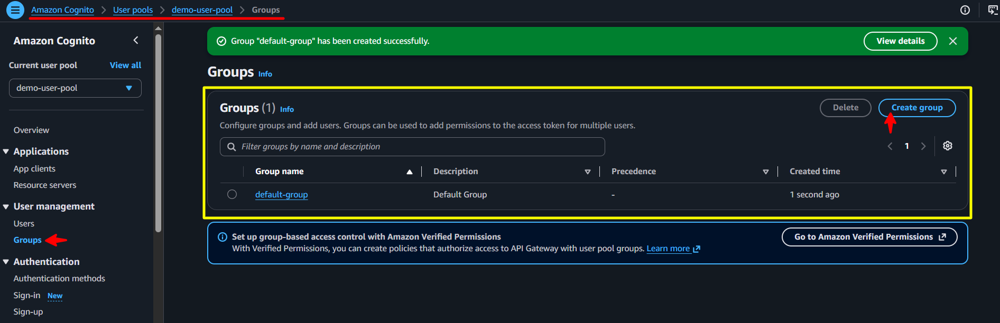

You can also assign users to these groups by navigating to the newly created group, and adding users to it. This can be done by selecting the **Group Members** section and clicking on **Add users**.

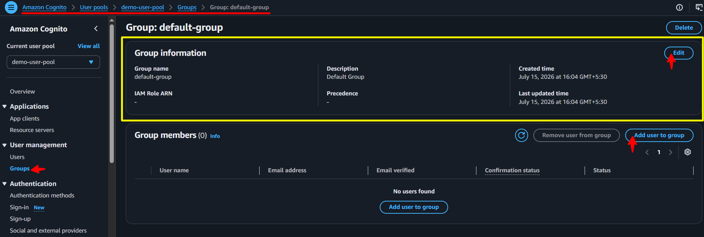


### *Step 10: Authentication Method Settings*

In the **Authentication Methods** settings, you can configure the authentication methods that users can use to sign in to your application. There are multiple important settings that you can configure in this section as shown in the image below.

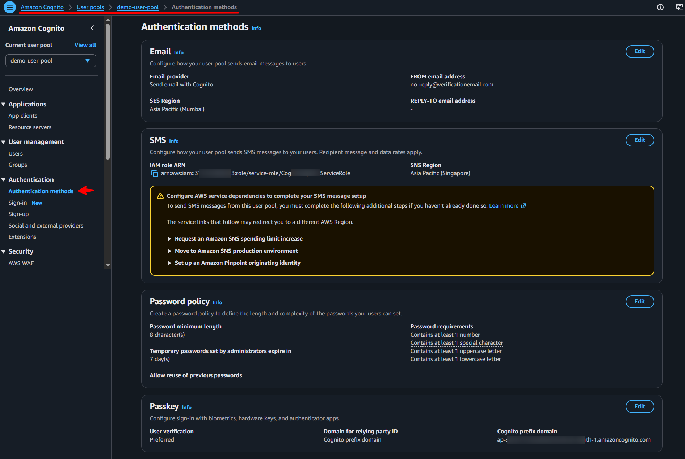

Key settings to consider include:
- Email Configuration: Configure the email settings for your user pool. You can choose to use the default Amazon Cognito email service or configure a custom email provider.
- SMS Configuration: Configure the SMS settings for your user pool. You can choose to use the default Amazon Cognito SMS service or configure a custom SMS provider.
- Password Policy: Configure the password policy for your user pool. You can set requirements for password length, complexity, and expiration.
- Passkey Configuration: Configure the passkey policy for your user pool.


### *Step 11: Sign-in Settings*

In the **Sign-in** settings, you can configure the attributes that users can use to sign in to your application.

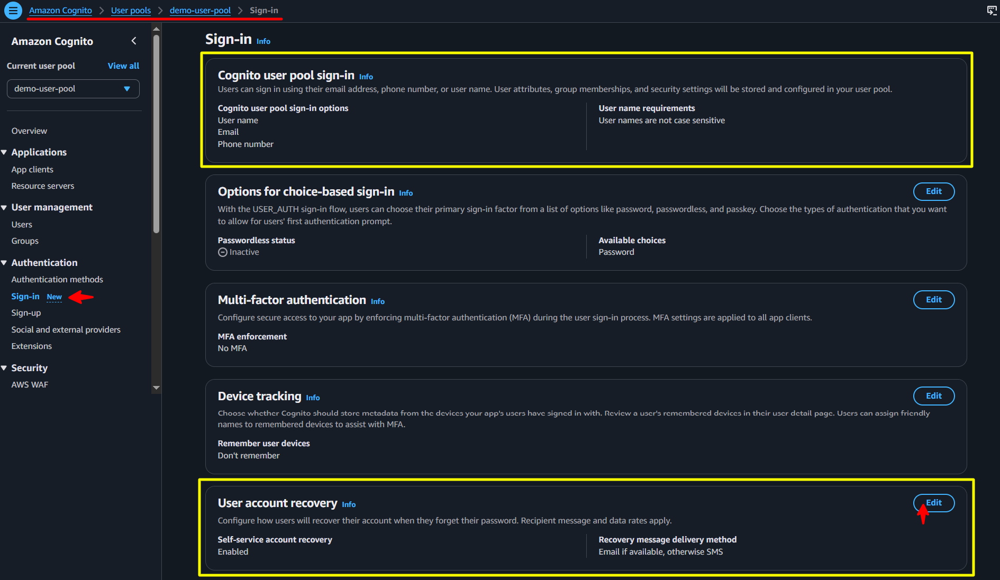

Review the **Sign-in** settings and ensure that the attributes you want to allow for sign-in are selected. You can choose to allow users to sign in with their email, phone number, or username. This will determine how users authenticate when accessing your application (to be done at the User Pool level setup).

Select the account recovery settings based on your application requirements. You can choose to allow users to recover their accounts using email, phone number, or both. This will help users regain access to their accounts if they forget their passwords.

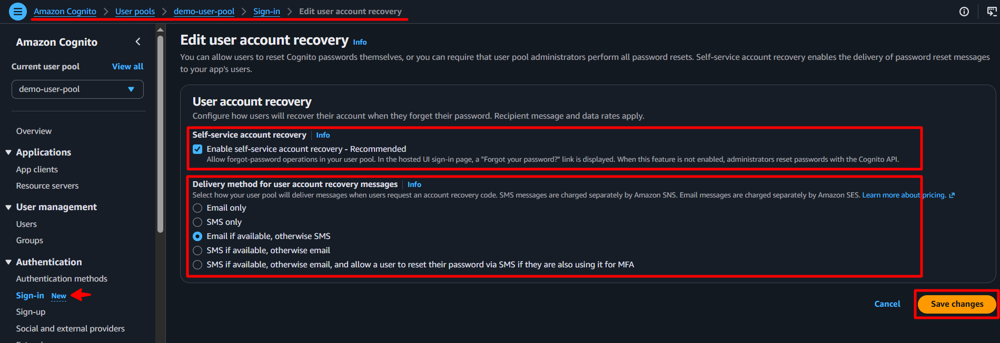

Select the options as shown in the image above. However, for the advanced users, you can change the settings based on your application requirements.


### *Step 12: Sign-up Settings*

In the **Sign-up** settings, you can configure the attributes that users need to provide during registration.

- You can configure the verification settings for email and phone number.
- You can also enable or disable self-registration based on your application requirements.

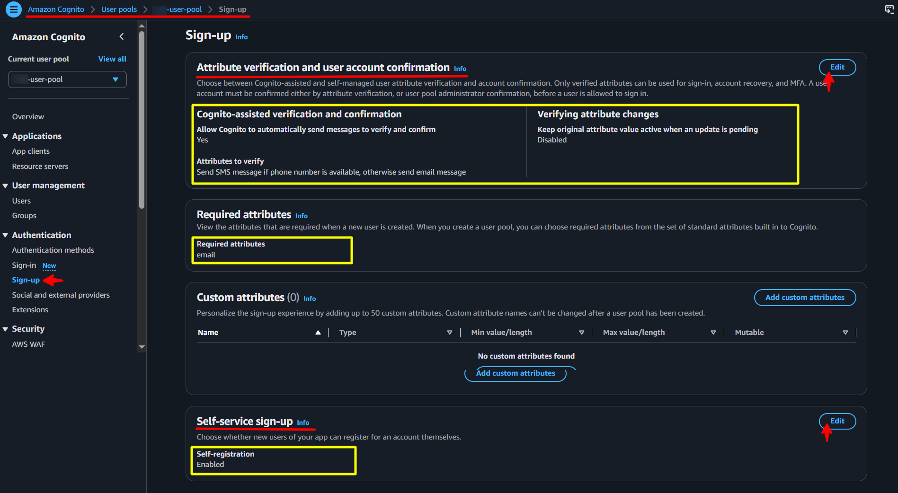

In order to configure the attribute verification, to enable user verification, select the attributes that you want to verify during the sign-up process. You can choose to verify email, phone number, or both. This will ensure that users provide valid contact information during registration.

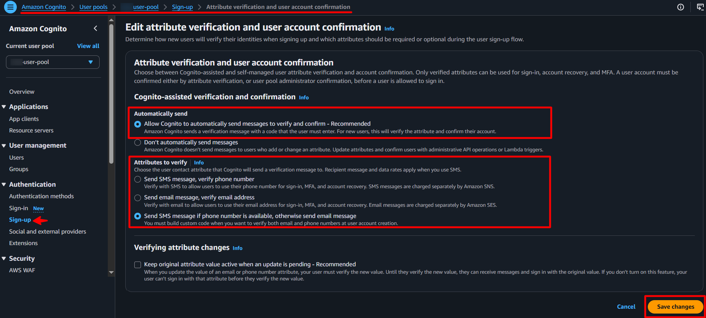

In order to enable self-registration, select the **Self-service sign-up** section as shown below. This will allow users to create their own accounts without requiring an administrator to create them.

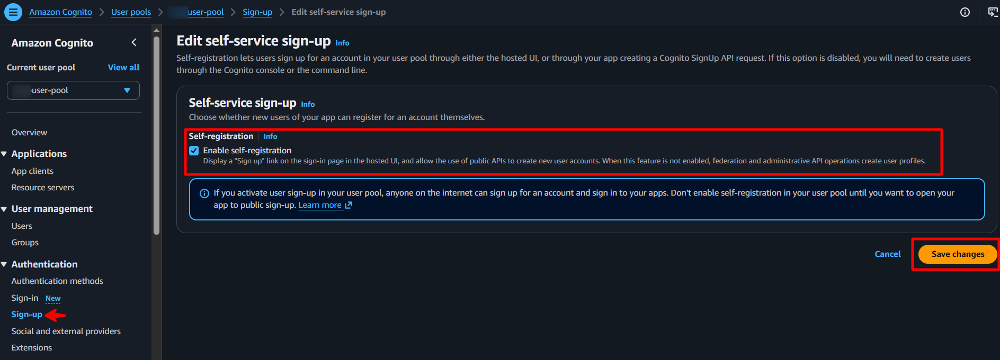


### *Step 13: Amend Message Templates* (Optional)

In the **Message Templates** settings, under the **Branding** subsection, you can customize the email and SMS messages sent to users during various stages of the authentication process, such as account verification, password reset, and multi-factor authentication.

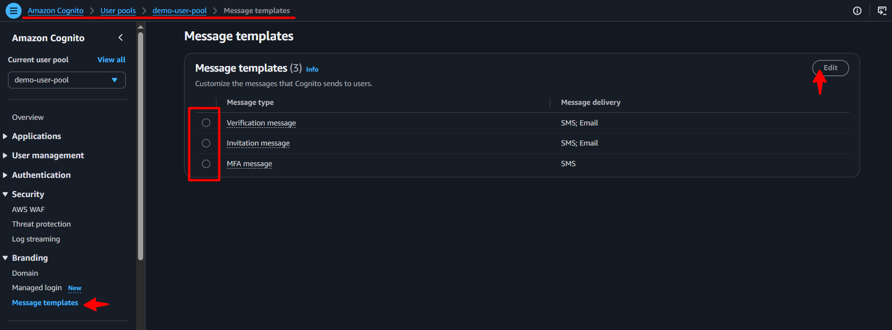

Select the template in the list, and click on the **Edit** button to customize the messages. You can modify the subject, body, and other settings for each message type.

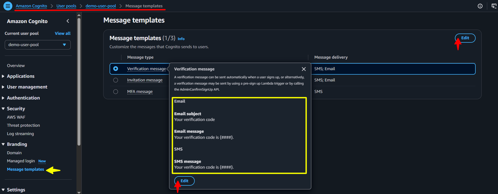


## References
- [AWS Cognito Documentation](https://docs.aws.amazon.com/cognito/latest/developerguide/what-is-amazon-cognito.html)
- [AWS Cognito User Pool Settings](https://docs.aws.amazon.com/cognito/latest/developerguide/cognito-user-pools.html)
- [Import a user CSV file to your Cognito Pool](https://docs.aws.amazon.com/cognito/latest/developerguide/cognito-user-pools-using-import-tool.html)
- [AWS Cognito App Client Settings](https://docs.aws.amazon.com/cognito/latest/developerguide/user-pool-settings-client-apps.html)
- [AWS Cognito Password Policy](https://docs.aws.amazon.com/cognito/latest/developerguide/managing-users-passwords.html#user-pool-settings-policies)
- [AWS Cognito Security](https://docs.aws.amazon.com/cognito/latest/developerguide/security.html)
