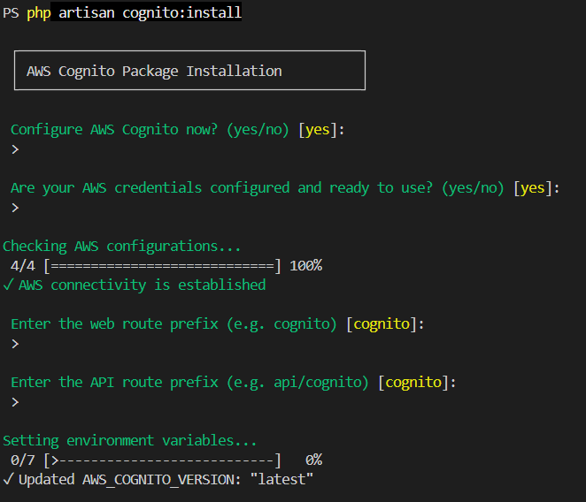

# Console Commands

> [!NOTE]
> Last Updated: <!-- AUTO:last_updated -->2026-07-31<!-- /AUTO:last_updated -->

The package provides a set of console commands to manage AWS Cognito installation, configuration and monitoring some activities. These commands can be used to perform various operations such as managing user pools, clients, groups, updating user attributes, and more.


## Contents

- [AWS IAM Configuration](#aws-iam-configuration)
- Console Commands
    + [Installation](#installation)
    + [Make Command](#make-command)
    + [List Command](#list-command)
    + [Sync Command](#sync-command)


## AWS IAM Configuration

When using the `install` or `make` commands with **SMS-based authentication**, additional AWS IAM permissions are required to configure Amazon Cognito SMS messaging.

### Create an IAM Role for Amazon SNS

For SMS messaging, create an IAM role that Amazon Cognito can assume to publish SMS messages through **Amazon SNS**.

The role's **trust policy** must allow the Amazon Cognito service to assume the role. For example:

```json
{
    "Version": "2012-10-17",
    "Statement": [
        {
            "Effect": "Allow",
            "Principal": {
                "Service": "cognito-idp.amazonaws.com"
            },
            "Action": "sts:AssumeRole"
        }
    ]
}
```


### Grant iam:PassRole Permission

The AWS IAM user or role executing the install or make command must have the `iam:PassRole` permission for the IAM role created for Amazon Cognito SMS messaging.

This permission allows the command to associate the IAM role with the Cognito User Pool during configuration.

For security, restrict `iam:PassRole` to the specific IAM role required by your Cognito configuration. Do not grant iam:PassRole on all IAM roles (*) unless explicitly required.

The following is an example iam:PassRole policy:

```json
{
    "Version": "2012-10-17",
    "Statement": [
        {
            "Effect": "Allow",
            "Action": "iam:PassRole",
            "Resource": "arn:aws:iam::<AWS_ACCOUNT_ID>:role/<COGNITO_ROLE_NAME>"
        }
    ]
}
```
Replace <AWS_ACCOUNT_ID> and <COGNITO_ROLE_NAME> with your AWS account ID and the name of the IAM role created for Cognito SMS messaging.


## Console Commands

### Installation

The installation command is used to set up the necessary configuration files and environment variables for AWS Cognito integration in your Laravel application. It will guide you through the process of configuring your AWS Cognito User Pool and App Client settings.

```sh
php artisan cognito:install
```

The installation command will prompt you to enter the following information as part of the setup process.


The process will synchronize down the configuration values to the `.env` file from the AWS Cognito User Pool and App Client. It will also create a default group in the Cognito User Pool if it does not already exist.


### Make Command

The make command is used to generate various components related to AWS Cognito integration in your Laravel application. It can be used to create user pools, clients, groups, and other necessary components required for AWS Cognito integration.

The command below demonstrates how to create a new user pool using the make command. You can specify the name of the user pool and any additional options as needed.

```sh
php artisan cognito:make newpool --pool
```

Similarly, you can use the make command to create clients, groups, and other components by specifying the appropriate options. Use the `--help` option to see the available options and their usage.

### List Command

The list command is used to retrieve and display information about various resources in AWS Cognito, such as user pools, clients, terms, and groups. It allows you to view the details of these resources in a structured format.

The command below demonstrates how to list the user pools in your AWS Cognito account. You can specify the `--pool` option to retrieve the list of user pools.

```sh
php artisan cognito:list --pool
```

Similarly, you can use the list command to retrieve information about clients, terms, and groups by specifying the appropriate options. Use the `--help` option to see the available options and their usage.

The default output format is a table, but you can also specify the `--format=json` option to retrieve the data in JSON format.


### Sync Command

The sync command is used to synchronize the local configuration with the AWS Cognito settings. It ensures that the local configuration files and environment variables are up to date with the latest changes made in the AWS Cognito User Pool and App Client settings. It synchronizes the configuration values from AWS Cognito to the local environment and vice versa, ensuring that both are in sync.

```sh
php artisan cognito:sync --aws-to-local
```
This command will synchronize the configuration values from AWS Cognito to the local environment, updating the `.env` file with the latest settings.

```sh
php artisan cognito:sync --local-to-aws
```
This command will synchronize the configuration values from the local environment to AWS Cognito, updating the user pool and app client settings with the latest local configuration.

For more information on the available options and their usage, use the `--help` option with the sync command.
