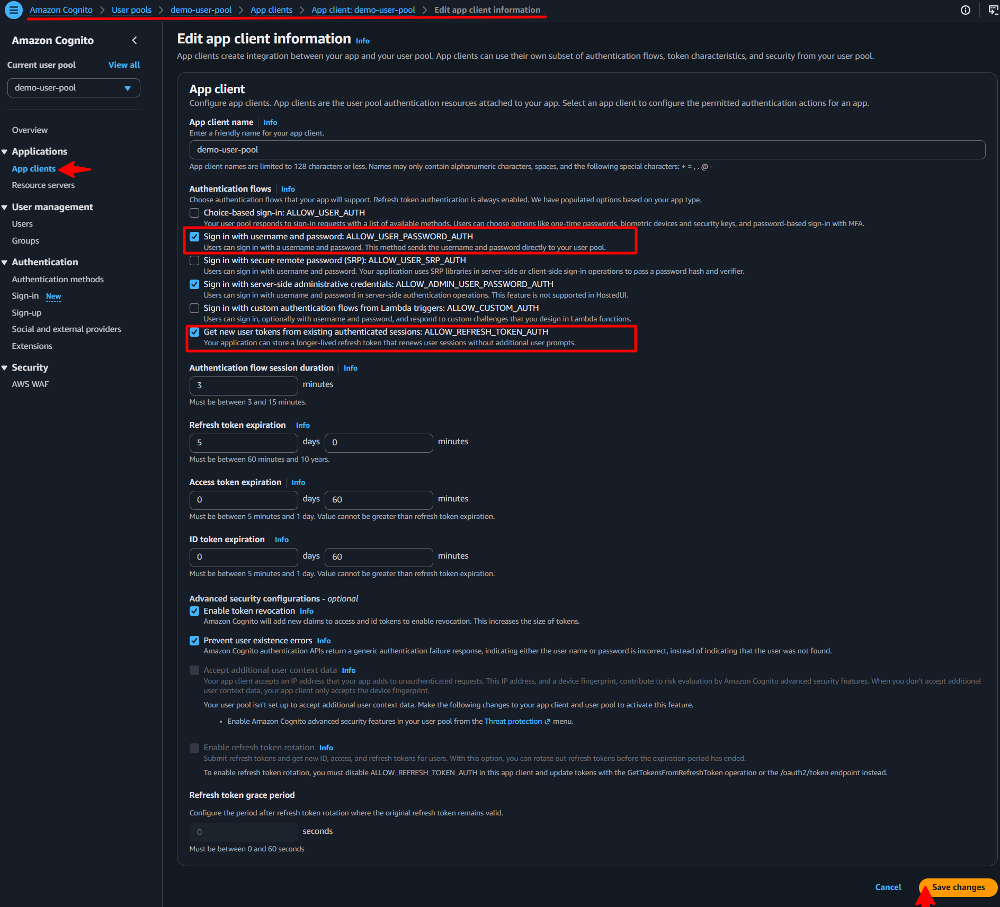

# **AWS Cognito Core Functionality**

> [!NOTE]
> Last Updated: <!-- AUTO:last_updated -->2026-07-31<!-- /AUTO:last_updated -->

## Contents
- [Introduction](#introduction)
- [Configurations](#configurations)
- [Features](#features)
- Quick Start
    - [Blade Component](#blade-component-web-app)
- Advanced Topics
    - [API Documentation](#api-documentation)
    - [API Routes](#api-routes)
- [References](#references)


## Introduction


## Configurations
- [AWS Configurations](#aws-configurations)
- [Laravel Configurations](#laravel-configurations)


### *AWS Configurations*

For authentication to work, you need to configure the AWS Cognito User Pool and App Client settings. The package provides a detailed guide on how to configure the AWS Cognito User Pool and App Client settings. Please refer to the [AWS Cognito Configuration](COGNITOCONFIG.md) section for more details.

For password based authentication to work, you need to configure the App Client settings and enable `ALLOW_USER_PASSWORD_AUTH`. Similarly, for refresh token based authentication to work, you need to enable `ALLOW_REFRESH_TOKEN_AUTH` as shown below in the image.



Use the admin based authentication by enabling `ALLOW_ADMIN_USER_PASSWORD_AUTH`. This is useful in scenarios where you want to authenticate the user using the admin credentials.


### *Laravel Configurations*

The package allows some configurations, which can be set in the .env file. The default values are set in the configuration file. You can change the default values by setting the keys in the .env file.

```env
# Enable self registration for users
AWS_COGNITO_REGISTRATION_ENABLED=true //optional - default value is false.

# Configuration for user group assignment for registered or invited users.
AWS_COGNITO_DEFAULT_USER_GROUP="Customers" //optional - default value is null.

AWS_COGNITO_FORCE_NEW_USER_PASSWORD=true //optional - default value is false.

# Configuration for user invitation only
AWS_COGNITO_NEW_USER_MESSAGE_ACTION="SUPPRESS" //optional - default value is null.
AWS_COGNITO_FORCE_NEW_USER_EMAIL_VERIFIED=true //optional - default value is false.
```

## Features

- [Registering Users OR Sign Up](#registering-users-or-sign-up)
    + [Self Registration](#self-registration)
    + [Verification of User](#verification-of-user)

- [User Invitation OR Invite User](#user-invitation-or-invite-user)
- [User Authentication OR Sign In](#user-authentication-or-sign-in)
- [Log Out OR Sign out](#log-out-or-sign-out)
    + [Sign out and remove access tokens](#sign-out-and-remove-access-tokens)

- [Forgot Password](#forgot-password)
- [Refresh Token](#refresh-token)
- [Delete User](#delete-user)
- [Single Sign-On (SSO)](#single-sign-on)
- [Password Validation](#password-validation)
- [Token Validation](#token-validation)


### Registering Users OR Sign Up

The registration process is simplified into just two steps, self registration and verification. They are detailed below in detail. The overall process is now simplified to just a couple of steps. You can use the preconfigured controller and routes provided by us or you can implement your own controller and routes.

To enable user defined password to be set during registration or invitation, the key `AWS_COGNITO_FORCE_NEW_USER_PASSWORD` in the environment setting should be set to **true** as shown in the [Laravel Configurations](#laravel-configurations) section. This forces the user to set the password during registration, else cognito will generate a random password and send over email and/or SMS based on the configurations.

This package also supports the AWS Cognito Groups. You can assign a default group to a new user when registering or inviting. This can be configured in the environment file. Use the key `AWS_COGNITO_DEFAULT_USER_GROUP` to set the default group name. The group name should be as per the configuration done via AWS Cognito Management Console. The default value is set to null. 


#### *Self Registration*

The package provides you with a trait that makes the registration process very simple. The package provides a trait `RegistersUsers` that you can add to your controller to make the registration process functional. The namespace for the trait is `Ellaisys\Cognito\Auth\RegistersUsers`. The trait has the capability to handle the following registration types:
    - `register` (self registration), and
    - `invite` (admin invited registration).

You will need to configure the AWS Cognito User Pool to allow [Self Registration](COGNITOCONFIG.md#step-11-sign-up-settings). If this is not enabled, then the users will have to be created by an administrator by inviting them to the application.

Also, you will need to configure the `AWS_COGNITO_REGISTRATION_ENABLED` key in the environment file to **true** to allow self registration. The default value is set to false. Refer to the [Laravel Configurations](#laravel-configurations) section for more details.

After the user is successfully registered, the status of the user is `UNCONFIRMED` and email is `UNVERIFIED`. A verification email is sent to the user's email and/or phone number.

The package provides routes and controllers for the registration process. You can use the preconfigured controller and routes provided by us or you can implement your own controller and routes.

```php
//Route to register a new user
use Ellaisys\Cognito\Http\Controllers\Auth\RegisterController;
...

Route::group(['prefix' => 'register'], function() {
    Route::get('/',  function () { return view('cognito::pages.auth.registers.register'); })->name('form.register');
    Route::post('/', [RegisterController::class, 'actionRegister'])->name('action.register.submit');
});
```

##### Advanced Registration Options

In case you want to customize the registration process, and write your own controller, you can use the `register` method provided by the trait. The method takes a collection of user data and creates a new user in the AWS Cognito User Pool. The method returns user object on successful registration.

```php
use Ellaisys\Cognito\Auth\RegistersUsers;

class RegisterController extends Controller
{
    use RegistersUsers;
    protected $clientMetadata = null;

    public function __construct()
    {
        $this->middleware('guest')->except(['actionInvite', 'invite']);

        //Set flag to indicate action called from controller
        $this->setIsControllerAction(true);

        parent::__construct();
    } //Function ends

    public function actionRegister(\Illuminate\Http\Request $request)
    {
        ...
        //Get Registered User
        $user = $this->register($request, $this->clientMetadata);
    }
}
```

The trait triggers `PreRegistrationEvent` and `PostRegistrationEvent` events before and after the registration process. You can listen to these events and perform any additional actions as per your business requirement.


#### *Verification of User*

The verification of the user is handled by the `VerifiesEmails` trait. You can use the preconfigured controller and routes provided by us or you can implement your own controller and routes.

The trait has two key methods, `verify` and `resend`. As the name suggests, the verify method is used to verify the users email and/or phone. The resend method is to be called incase the user has not received the email or the code/link has expired. The resend method will send a new verification link to the user.

After the user is successfully verified, the status of the user is `CONFIRMED` and email is `VERIFIED`.

The routes for the verification process are provided by us. You can use the preconfigured controller and routes provided by us or you can implement your own controller and routes.

```php
//Route to verify a new user
use Ellaisys\Cognito\Http\Controllers\Auth\VerificationController;
...

Route::group(['prefix' => 'register/verify'], function() {
    Route::get('/',  function () { return view('cognito::pages.auth.registers.verify'); })->name('form.register.verify');
    Route::post('/', [VerificationController::class, 'verify'])->name('action.register.verify');

    Route::group(['prefix' => 'resend-code'], function() {
        Route::get('/',  function () { return view('cognito::pages.auth.registers.resend'); })->name('form.register.resend_code');
        Route::post('/', [VerificationController::class, 'resend'])->name('action.register.resend_code');
    });
});
```


### User Invitation OR Invite User

A new user can be invited by an administrator into the application. The invitation process is simplified into simple steps, `invite` and `verification`. However, you can also auto-verify the user. You can use the preconfigured controller and routes provided by us or you can implement your own controller and routes.

In case you want to suppress the invitation mail sent to the new users, set the environment variable `AWS_COGNITO_NEW_USER_MESSAGE_ACTION` to **SUPPRESS**. You can configure the parameter given below to skip welcome mails to new user registration. Default configuration shall send the welcome email.

Similarly, you can also auto-verify the new user by setting the environment variable `AWS_COGNITO_FORCE_NEW_USER_EMAIL_VERIFIED` to **true**. This will mark the new user's email address as verified. Default configuration shall not mark the email address as verified and the user will have to verify the email address by clicking on the link sent to the email address.


### User Authentication OR Sign In

Basic password based user authentication is simplified into just one step, the login. It is essential that the `ALLOW_USER_PASSWORD_AUTH` is enabled in the AWS Cognito User Pool. For details on how to enable this, please refer to the [AWS Cognito Configuration - App Client Settings](COGNITOCONFIG.md#step-6-edit-app-client-settings) section.

Other authentication types like SRP, MFA, Passkeys, etc. are also supported by the package. In case you want to know more about these authentication types, please refer to the [AWS Cognito Configuration - App Client Settings](COGNITOCONFIG.md#step-6-edit-app-client-settings) section, OR  you can refer the features section of this document for more details.

The package provides you with a trait that makes the authentication process very simple. The package provides a trait `AuthenticatesUsers` that you can add to your controller to make the authentication process functional. The namespace for the trait is `Ellaisys\Cognito\Auth\AuthenticatesUsers`. The trait has the capability to handle the following authentication types:
    - `attemptLogin` (Login with username and password), and
    - `attemptLoginSRP` (Login with SRP)
    - `challenge` (Login with challenge e.g. MFA, Passkeys, etc.)

You can use the preconfigured controller and routes provided by us or you can implement your own controller and routes. The package provides routes and controllers for the authentication process.

```php
//Route to authenticate a user

use Ellaisys\Cognito\Http\Controllers\Auth\LoginController;
...
Route::post('/login', [LoginController::class, 'login']);
Route::post('/login/srp', [LoginController::class, 'loginSRP']);
Route::post('/login/challenge', [LoginController::class, 'actionChallenge']);
```

The trait triggers `PreAuthEvent`, `PostAuthSuccessEvent` and `PostAuthFailedEvent` events before and after the login process. You can listen to these events and perform any additional actions as per your business requirement.


##### Advanced Authentication Options

For advanced authentication options, you can use the `attemptLogin` method provided by the trait. The method takes a collection of user data and authenticates the user in the AWS Cognito User Pool. The method returns a claim object on successful authentication. The credential object in the request should contain the `username` and `password` parameters for Basic Authentication. The method also takes an optional parameter to specify the authentication flow type. The default value is `USER_PASSWORD_AUTH`.

```php
use Ellaisys\Cognito\AwsCognitoClaim;
use Ellaisys\Cognito\Auth\AuthenticatesUsers;
use Ellaisys\Cognito\Enums\CognitoAuthFlowTypes;
...

class LoginController extends Controller
{
    use AuthenticatesUsers;

    public function __construct()
    {
        $this->middleware('guest')->except(['logout']);
        $this->setIsControllerAction(false); //Set flag to indicate action called from controller
        parent::__construct();
    } //Function ends

    public function login(\Illuminate\Http\Request $request)
    {
        ...
        $claim = $this->attemptLogin($request, CognitoAuthFlowTypes::USER_PASSWORD_AUTH);

        if ($claim instanceof AwsCognitoClaim) {
            //Authentication successful
            ...
        } else {
            // Challenge generated, handle the challenge
            ...
        } //End if

    } //Function ends
}
```


### Log Out OR Sign out

The package provides you with a trait that makes the logout process very simple. The package provides a trait `AuthenticatesUsers` that you can add to your controller to make the logout process functional. The namespace for the trait is `Ellaisys\Cognito\Auth\AuthenticatesUsers`. The trait has the capability to handle the following logout types:
    - `logout` (Logout, but persists the refresh token), and
    - `logout(true)` (Logout, and revoke the refresh token)

In multiple application scenarios, you may want to logout the user from one application then use the `logout()` method to persist the refresh token. This will allow the user to maintain the session in other applications.

#### Sign out and remove access tokens
In case you want to logout the user from all applications, you can use the `logout(true)` method to revoke the refresh token. This prohibits the user from using the refresh token to get a new access token. This will require the user to authenticate again in all applications. This is useful in Single Sign-On scenarios where you want to logout the user from all applications. This is detailed in the [Single Sign-On](#single-sign-on) section.

If you are using the routes provided by us, you can use the preconfigured controller with following routes. You can use the preconfigured controller and routes provided by us or you can implement your own controller and routes.

```php
//Route to logout a user, secure the route with auth middleware
use Ellaisys\Cognito\Http\Controllers\Auth\LoginController;
...
Route::post('/logout', [LoginController::class, 'logout']);
Route::post('/logout/forced', [LoginController::class, 'logoutForced']);
```

The trait triggers a `PreLogoutEvent` and `PostLogoutEvent` during the logout process. You can listen to these events and perform any additional actions as per your business requirement.

##### Advanced Logout Options

For advanced logout options, you can use the `logout` method provided by the trait. The method takes a boolean parameter to indicate whether to revoke the refresh token or not. The method returns a boolean value indicating whether the logout was successful or not.

```php
...
Auth::guard('api')->logout();

...
Auth::guard('api')->logout(true); //Revoke the Refresh Token.
```


### Forgot Password

As per the AWS Cognito default feature, the forgot password feature is not allowed for users who have not activated their account. We have introduced a feature that allows the password to be resent to the user even if they have not activated their account. This is useful in scenarios where the user has not received the activation email or the activation link has expired.

To enable this feature, you can set the environment variable `AWS_COGNITO_ALLOW_FORGOT_PASSWORD_RESEND` to **true**. The default value is **true**. You can set it to **false** if you do not want to allow the password to be resent to the user.

```env
AWS_COGNITO_ALLOW_FORGOT_PASSWORD_RESEND=true
```

The package provides you with a trait that makes the forgot password process very simple. The package provides a couple of traits `SendsPasswordResetEmails` and `ResetsPasswords` that you can add to your controller to make the forgot password process functional.

The flow for the forgot password process is as follows:
1. The user requests a password reset by providing their email address. You can use the `sendResetLinkEmail` method provided by the `SendsPasswordResetEmails` trait to send a password reset email to the user.
2. The system sends a password reset code to the user's email address, which is valid for a limited time. The user can use this code to reset their password.
3. The user provides the password reset code and their new password. Use the `reset` method provided by the `ResetsPasswords` trait to reset the user's password using the code sent to the user.


### Refresh Token

The package provides you with a trait that makes the refresh token process very simple. The package provides a trait `RefreshToken` that you can add to your controller to make the refresh token process functional. The namespace for the trait is `Ellaisys\Cognito\Auth\RefreshToken`. The trait has the capability to handle the following refresh token types:
    - `refresh` (Refresh the access token using the refresh token)
    - `revalidate` (Authenticate using the refresh token)

The `refresh` method requires an active access token to be present in the request. The `revalidate` method does not require an active access token to be present in the request. The `revalidate` method is useful in scenarios where the access token has expired and you want to re-authenticate the user using the refresh token.

The package provides routes and controllers for the refresh and revalidate token process. You can use the preconfigured controller and routes provided by us or you can implement your own controller and routes.

```php
//Route to refresh a token
use Ellaisys\Cognito\Http\Controllers\Auth\RefreshTokenController;
...
Route::post('/token/revalidate', [RefreshTokenController::class, 'revalidate']);
Route::post('/token/refresh', [RefreshTokenController::class, 'refresh'])->middleware('aws-cognito');
```

A feature that we have implemented is the ability to handle revalidate tokens seamlessly, a URL that you can use in the browser to authenticate the user using the refresh token. This is useful in scenarios where the access token has expired and you want to re-authenticate the user using the refresh token as shown below:

```http
GET <base_url>/token/revalidate?email={email}&refresh_token={refresh_token}
```


#### Advanced Refresh Token Options

In case you want to customize the refresh token process, and write your own controller, you can use the `refresh` method provided by the trait. The method takes a collection of user data and refreshes the access token using the refresh token. The method returns a claim object on successful refresh.

```php
...
use Ellaisys\Cognito\Auth\RefreshToken;

class RefreshTokenController extends Controller
{
    use RefreshToken;

    /**
     * Generate a new claim using the revalidate approach
     */
    public function revalidateToken(\Illuminate\Http\Request $request)
    {
        ...
        $validator = $request->validate([
            'email' => 'required|email',
            'refresh_token' => 'required'
        ]);
        
        return $this->revalidate($request, 'email', 'refresh_token');
    } //Function ends

    /**
     * Generate a new claim using refresh token.
     * @return mixed
     */
    public function refreshToken(\Illuminate\Http\Request $request)
    {
        ...
        return $this->refresh($request);
    } //Function ends
} //Class ends
```


### Delete User

If you want to give your users the ability to delete themselves from your app you can use our deleteUser function
from the CognitoClient.

To delete the user you should call deleteUser and pass the email of the user as a parameter to it.
After the user has been deleted in your cognito pool, delete your user from your database too.

```php
$cognitoClient->deleteUser($user->email);
$user->delete();
```

We have implemented a new config option `delete_user`, which you can access through `AWS_COGNITO_DELETE_USER` env var.
If you set this config to true, the user is deleted in the Cognito pool. If it is set to false, it will stay registered.
Per default this option is set to false. If you want this behaviour you should set USE_SSO to true to let the user
restore themselves after a successful login.

To access our CognitoClient you can simply pass it as a parameter to your Controller Action where you want to perform
the deletion.

```php
public function deleteUser(Request $request, AwsCognitoClient $client)
```

Laravel will take care of the dependency injection by itself.

```
    IMPORTANT: You want to secure this action by maybe security questions, a second delete password or by confirming 
    the email address.
```


### Single Sign-On (SSO)

This package provides *Single Sign-On (SSO)* by using AWS Cognito as the central identity provider. By exposing both web interfaces and REST APIs, applications built with Laravel or any other programming language can delegate authentication to this package while sharing a common AWS Cognito User Pool.

Each application maintains its own local database and business data, while user authentication and identities are managed centrally by AWS Cognito. This allows users to access multiple applications with the same credentials without requiring separate user accounts for each application.


#### *How It Works*

When a user attempts to authenticate, the request is delegated to AWS Cognito. After a successful authentication, the package checks whether the user already exists in the application's local database.

If no local user record exists and the `add_missing_local_user` option is enabled, the package automatically provisions the user using the configured user model before completing the sign-in process.

This allows every application to maintain its own local user records while relying on a shared identity provider for authentication.

#### *Configuring the User Model*

The `sso_user_model` option specifies the Eloquent model used when automatically creating local users. For most Laravel applications, this will be:

```php id="f7cb9d"
App\Models\User::class
```

#### *Synchronizing User Attributes*

The `cognito_user_fields` option defines which user attributes are synchronized with AWS Cognito during registration.

Any attribute listed in this configuration must also be included in the registration request. If a configured attribute is missing, the package will throw an `HttpException` and the registration will fail.

If your application stores additional profile information, such as `firstname` or `lastname`, include those attributes in `cognito_user_fields`. Otherwise, they will only exist in the local application database and will not be available to other applications participating in SSO.

#### *Multiple Applications*

A single AWS Cognito User Pool can be shared by any number of applications, regardless of the technology stack. Since this package exposes both web interfaces and REST APIs, applications written in PHP, .NET, Java, Node.js, Python, Go, or any other language can authenticate users through the package while sharing the same centralized identity store.

When a user signs in to an application for the first time, the package automatically creates the corresponding local user record (when `add_missing_local_user` is enabled). This provides a seamless onboarding experience while allowing each application to maintain its own application-specific data.

#### *Password Management*

With SSO enabled, user passwords are managed exclusively by AWS Cognito and are never stored by the application.

If your local `users` table contains a `password` column, it is recommended to make the column nullable, as users created through SSO do not require a locally stored password.


### Password Validation

This package automatically retrieves the password policy configured in your AWS Cognito User Pool and generates the corresponding Laravel validation rules at runtime. This ensures that password validation within your application always stays in sync with your Cognito configuration, without requiring you to duplicate or manually maintain password rules.

Password validation is automatically applied to all password-based flows, including:

* Sign Up (Registration)
* Sign In (Login)
* Password Reset
* Password Change

Validation error messages are also generated dynamically based on your Cognito password policy, providing users with accurate guidance that reflects your current configuration.

Refer the [AWS Cognito Configuration - Password Policy](COGNITOCONFIG.md#step-10-authentication-method-settings) section for details on how to configure your password policy in AWS Cognito. The reference section below provides a link to the AWS documentation for more information on password policies.


### Token Validation

Access Tokens are automatically validated for all session-based and token guard authentication requests.

The package verifies the token signature using the public keys published by your AWS Cognito User Pool. If the token signature is invalid, the signing certificate cannot be verified, or the token has expired, authentication will fail and an exception will be thrown.

This ensures that only valid Access Tokens issued by your Cognito User Pool are accepted by your application.


## References
- [AWS Cognito Password Policy](https://docs.aws.amazon.com/cognito/latest/developerguide/managing-users-passwords.html#user-pool-settings-policies)
