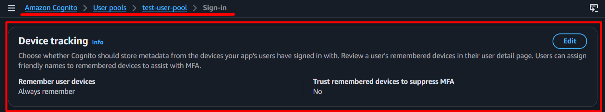
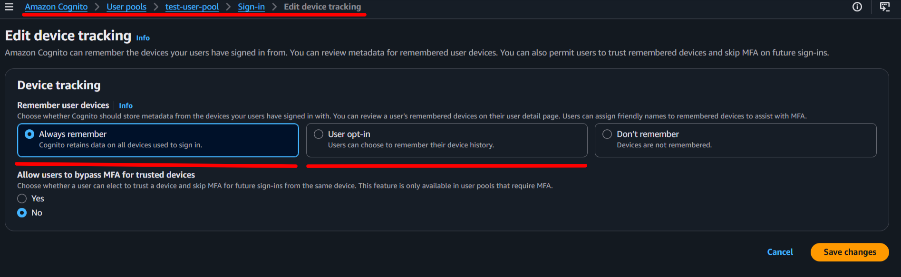

# **Device Authentication**

> [!IMPORTANT]
> We have released the **laravel blade components** as a feature from V2.0.6. These  component have php/html blade components and javascript functions to implement the FIDO2 Security Keys OR Passkey based functionality within your application. All FIDO2 Security features are supported.

## **Contents**
- [Introduction](#introduction)
- [Configurations](#configurations)
- [Features](#features)
- Quick Start
    - [Blade Component](#blade-component-web-app)
- Advanced Topics
    - [API Documentation](#api-documentation)
    - [API Routes](#api-routes)
- [References](#references)

## **Introduction**
With Amazon Cognito user pools, you can associate each of your users' devices with a unique device identifier: a device key. When you present the device key and perform device authentication at sign-in, you can configure your application with a trusted device authentication flow. Device authentication is a security feature that allows users to register and authenticate their devices with AWS Cognito. This feature enhances security by enabling multi-factor authentication (MFA) and device tracking, ensuring that only trusted devices can access user accounts. 

When a user logs in from a new device, they may be prompted to register the new device. Once registered, the device can be remembered for future logins, reducing the need for repeated MFA prompts. This feature is particularly useful for applications that require high security, such as banking or healthcare apps.

The device authentication process involves using logic similar to the SRP (Secure Remote Password) protocol, which allows for secure authentication without transmitting the user's device credentials. Instead, cryptographic operations are performed based on the device's unique identifier and the user's credentials. This ensures that sensitive information is never exposed over the network.

This document explains how you can use this in the context of AWS Cognito and Laravel package.

## **Configuration**
- [AWS Configurations](#aws-configurations)
- [Laravel Configurations](#laravel-configurations)

### AWS Configurations
---
Configure your user pool to remember devices in the Sign-in menu of your user pool, under Device tracking as shown below:


You can choose to always remember devices, or only remember them when the user opts in during sign-in. This setting allows you to control how devices are registered and remembered for future authentication attempts.


For more information on configuring device authentication in AWS Cognito, refer to the [AWS Cognito Documentation](https://docs.aws.amazon.com/cognito/latest/developerguide/amazon-cognito-user-pools-device-tracking.html).

### Laravel Configurations
---

## **Blade Component** (web app)
The package provides a blade component for 
1. `device management`, and 
2. `device authentication`

The device authentication component is integrated into the `challenge component`.

### *Device Management Functionality*
The package provides a blade component that you can use to implement the device `registration` and device `deletion` functionality in your pages.

You can use the component in your blade files as shown below. The component has all the required scripts, routes and methods to implement the device management functionality in your application.

The component uses the `DeviceActions` trait, which provides the necessary methods to implement this functionality in your application.

```html
    ...
    @section('content')
        <x-cognito::common.js-scripts /> <!-- Optional -->
        <x-cognito::device-auth />

        ...
        ...

        @stack('cognito-common-scripts') <!-- Optional (shall be added if you have used the common.js-scripts component) -->
        @stack('cognito-device-auth-scripts')
    @endsection
    ...
```
You can also use simple html buttons or any element with the data attributes to trigger the device management functionality as shown below.

The data attributes are used to trigger the necessary javascript functions to implement the device registration and deletion functionality in your application. The data attributes are as follows:
- `data-role`: This attribute is used to identify the element that will trigger the device functionality role. The value of this attribute must be ***device-auth***.
- `data-action`: This attribute is used to identify the action that will be performed when the element is clicked. The value of this attribute can be ***register*** or ***delete***. 
  - The `register` value is used to trigger the device registration functionality, and 
  - The `delete` value is used to trigger the device deletion (forget) functionality.

```html

    <button data-role="device-auth" data-action="register">
        Register Device</button>

    <button data-role="device-auth" data-action="delete">
        Delete Device</button>

```

### *Device Authentication Functionality*
The package provides a couple blade components that you can use to implement the device login functionality in your **login page** and **challenge page**.

On the login page, you can use the `device-auth` component to handle the device authentication flow.

```html

    ...
    <form method="POST" id="auth-password-form" ...>
        @csrf

        <x-cognito::device-auth
            :includeGMP="false"
            :includeCryptoJS="false"
            :includeCryptoUtils="false" />
        ...
        ...
        <!-- username field with data-action and data-role attribute -->
        <input type="email" id="username" name="username"
          data-role="device-auth" data-action="username"
          required autocomplete="email" autofocus />
        ...
        ...
        <!-- Button with data-action and data-role attribute -->
        <button type="submit" 
          data-role="device-auth" data-action="validate">Login</button>
    </form>
    ...
    @stack('cognito-device-auth-scripts')
    ...

```

This component will check if the device is already registered and will send the device key to the server if it is. If the device is not registered, it will proceed with the normal authentication flow. If the device is registered, the server will respond with a challenge that includes the necessary parameters for the next step of the authentication flow.

Use the `challenge` component in your challenge page to handle the device authentication flow. The component will handle the generation of the necessary values for the device proof and will send them back to the server in response to the challenge.

```html
    <form id="auth-challenge-form" method="POST" ...>
        ...
        <!-- pass the form name provided as a parameter to the component -->
        <x-cognito::challenge
            :challenge-form-name="'auth-challenge-form'" />
        ...
        ...
        @php
            $data = (session('data')) ?? null;
            $challengeNameValue = 'NONE';

            if ($data && isset($data['status']) && $data['status'] == 'challenge') {
                $challengeNameValue = isset($data['challenge_name']) ?
                    strtoupper($data['challenge_name']) :
                    $challengeNameValue;
            } //End if
        @endphp
        ...
        ...
        <div> <!-- Shows the passcode input field for the Password/OTP/TOTP based challenges only  -->
            @stack('cognito-challenge-passcode')
        </div>
        ...
        ...
        <!-- Button with data-action and data-role attribute -->
        <button type="submit"
            data-action="challenge-submit" data-role="{{ $challengeNameValue }}">
            Submit</button>
        ...
    </form>

    @stack('cognito-challenge-scripts')
    ...
```

Using this component will simplify the implementation of the device authentication functionality in your application.

The data is **secure** on the client side, as per the cyber security standards, and the necessary scripts and methods are provided in the component to implement the device feature in your application.

## **API Documentation**
This Laravel Package provides the necessary methods to implement device authentication functionality provided by AWS Cognito. The available challenges are dynamically provided from the trait making the user experience aligned to the AWS SDK.

The package provides a trait `DeviceActions` that you can add to your controller to provide custom functionality. The namespace for the trait is `Ellaisys\Cognito\Auth\DeviceActions`.

The CRUD methods are provided in the trait, as follows:
- list (List all the registered devices for the user)
- create (Register a new device for the user)
- update (Update the device information for the user)
- delete (Delete a registered device for the user)

The package also provides a Controller `DeviceController` with methods that you can alter. You can publish the controllers using the command below and then use the methods in your controller.
```sh

php artisan vendor:publish --provider="Ellaisys\Cognito\Providers\AwsCognitoServiceProvider" --tag="controllers"

```

### **Registering a New Device**
When a user logs in from a new device, they will be prompted to register the device. The registration process involves generating a unique device key and associating it with the user's account. This claim data is provided with additional **NewDeviceMetadata** having DeviceGroupKey and DeviceKey.

Generate a new SRP secret for your user's device and store it securely on the client side (e.g., in local storage or secure storage). This secret will be used for future device authentication attempts.

This secret is generated using the SRP protocol and is unique to the device. It should be treated as sensitive information and not shared or transmitted over insecure channels.

```sh

POST /device
Content-Type: application/json
Accept: application/json
{
  "device_key": "<device_key_in_NewDeviceMetadata>",
  "device_name": "<user_friendly_device_name_for_reference>"
}

```

## **API Routes**
>[!IMPORTANT]
>We are releasing the API predefined routes as a new feature from V1.3.0.
>php artisan vendor:publish --provider="Ellaisys\Cognito\Providers\AwsCognitoServiceProvider" --tag="controllers"

The package provides a set of API routes that you can use to implement the device management and authentication functionality in your application. The routes are grouped under the `device` namespace and are protected by the authentication middleware. You can customize the routes as per your application requirements.

```php

  GET|HEAD  api/cognito/device ...................... Ellaisys\Cognito\Http\Controllers\Auth\DeviceController@list
  POST      api/cognito/device .................... Ellaisys\Cognito\Http\Controllers\Auth\DeviceController@create
  PUT       api/cognito/device/{deviceKey} ........ Ellaisys\Cognito\Http\Controllers\Auth\DeviceController@update
  DELETE    api/cognito/device/{deviceKey} ........ Ellaisys\Cognito\Http\Controllers\Auth\DeviceController@delete

```

## **References**
- [AWS Cognito - Working with user devices in your user pool](https://docs.aws.amazon.com/cognito/latest/developerguide/amazon-cognito-user-pools-device-tracking.html)


## **Device Authentication Flow**

For this package, a new service is provided **Ellaisys\Cognito\Services\AwsCognitoSrpService** which implements the Device authentication flow. The flow consists of the following methods:
1. *loginWithDevice* - Initiates the device authentication process by sending the device key and receiving the authentication challenge from AWS Cognito.
2. *generateAuthSRP_A* - Generates the SRP_A value on the client side, along with the private ephemeral value 'a'.
3. *verifier* - Builds the response to the DEVICE_PASSWORD_VERIFIER challenge using the SRP_B, salt, and secret block received from the server.

### **Step 1: Login with Device**
The client initiates the device authentication process by sending the device key to the server. The server then calls AWS Cognito's endpoint to initiate the authentication process and receives the authentication challenge.

The package provides the component to be added to your login view, which will handle the device authentication flow. When the user submits their username and password, the component will check if the device is already registered. If not, it will not send the device key to the server and will proceed with the normal authentication flow.

If you are using the API based implementation, you can call the standard login endpoint method from your controller to initiate the device authentication process. This method will handle the communication with AWS Cognito and return the necessary challenge parameters for the next step of the authentication flow. It just requires an additional parameter **device_key** to be sent along with the username and password in the request body. The device key is a unique identifier for the registered device and is used to authenticate the device during the login process.

```sh

POST /login
Content-Type: application/json
Accept: application/json
{
  "username": "<username_for_login>",
  "password": "<password_for_login>",
  "device_key": "<device_key_of_registered_device>"
}

```

The server will then process this request and call AWS Cognito's endpoint to initiate the authentication process. If the device key is valid and the user credentials are correct, AWS Cognito will respond with an authentication challenge **DEVICE_SRP_AUTH** that includes the necessary parameters for the next step of the authentication flow.

### **Step 2: SRP_A Generation**

The package expects the client (browser/mobile app) to compute the SRP_A value before sending it to the server. This is a critical part of the SRP protocol, as it ensures that the actual password is never transmitted. However, for ease you can have the package compute SRP_A on the server side as well, but this is not recommended for security reasons.
**IMPORTANT: SRP_A is calculated BEFORE receiving the salt from the server.**

The SRP_A value is generated **on the client side** (browser/mobile app) using the following mathematical operation:

$$SRP\_A = g^a \bmod N$$

Where:
- **a** = A cryptographically secure random integer generated by the client
- **g** = Generator (provided by AWS Cognito)
- **N** = Large prime modulus (provided by AWS Cognito)
- **mod** = Modulo operation

The client sends the following to the server:

```sh

POST /login/auth-challenge
Content-Type: application/json
Accept: application/json
{
  "challenge_name": "DEVICE_SRP_AUTH",
  "session": "<session_token_from_the_server>",
  "username": "<username_for_srp>",
  "challenge_value": "<computed_challenge_value>",
  "challenge_params": "<returned_challenge_params_from_the_server>"
}

```

The `srp_a` field here contains the **pre-computed SRP_A value** (not the actual user password). if you choose not to compute SRP_A on the client side, you can omit this field and the package will compute it for you on the server side. 

However, for **higher security**, it is recommended to compute SRP_A on the client side and send it to the server. If you choose to compute the SRP_A value on the client side, make sure to use a secure random number generator for calculating the private ephemeral value `a` as per the SRP protocol specifications.

Store the private ephemeral value `a` securely on the client side (e.g., in memory) and do not transmit it to the server. Share a unique session token (e.g., a UUID) with the server so that responses from the server can be correlated with the correct authentication session. This session value is can be used to recover the private ephemeral value `a` on the client side when processing the server's challenge response in the next step.

Example:
1. Client generates a private ephemeral value `a` and computes `SRP_A` using the formula above.
2. Client also generates a unique session token (e.g., UUID) to correlate the authentication session.
3. Client stores the session token and the private ephemeral value `a` securely on the client side (e.g., in memory) as a key-value pair, where the session token is the key and the private ephemeral value `a` is the value.
4. Client sends the username, computed `SRP_A`, and session token to the server.
5. The server responds with the authentication challenge, which includes the salt, secret block, and SRP_B values needed for the next step of the authentication process. The server also includes the same session token in its response so that the client can correlate the response with the correct authentication session and retrieve the corresponding private ephemeral value `a` for processing the challenge response.
6. The client uses the session token to retrieve the private ephemeral value `a` from memory and processes the server's challenge response to compute the password proof, which is then sent back to the server for verification.
7. The client also sends the private ephemeral value `a` back to the now as a session value in the next step when responding to the server's challenge, so that the server can use it to verify the password proof and authenticate the user.

### **Step 3: Server-Side Processing**

The server receives the request and calls AWS Cognito's endpoint. AWS Cognito processes the SRP_A value and responds with a challenge that includes the following parameters:

AWS Cognito responds with:
- **SRP_B**: Server's SRP value
- **Salt**: Used in password hashing
- **SecretBlock**: Encrypted information from the server
- **UserIdForSrp**: User identifier for SRP calculations
- **Session**: Session token for the ongoing authentication process
- **ChallengeName**: Typically "PASSWORD_VERIFIER" indicating the next step in the authentication process

### **Step 4: Device Proof Calculation**

Generate the device hash (with SHA256 encryption) using the device group id, device key and the device secret. You can use the following formula to calculate the device proof:

```javascript

    // Set the actual device secret value in the hidden challenge value input
    let deviceKey = deviceGroupId + deviceKey+ ':' + deviceSecret;

    // Hash with SHA256 and set the hashed value in the challenge value input
    let passKeyHash = await hashEncrypt(passKey, 'SHA-256');
```

Send that value back to the server in response to the challenge with **PASSKEY_HASH** as the key OR you can generate the **PASSWORD_CLAIM_SIGNATURE** using the blade component provided in the package and send that value back to the server in response to the challenge with **PASSWORD_CLAIM_SIGNATURE** as the key. The package will handle the generation of the PASSWORD_CLAIM_SIGNATURE using the device proof and other parameters received from the server.

### **Step 5: Respond to the Auth Challenge**

The client sends the following to the server:

```
POST /login/auth-challenge
Content-Type: application/json

{
  "challenge_name": "DEVICE_PASSWORD_VERIFIER",
  "session": "<session_token_as_private_ephemeral_value_a>",
  "username": "<username_for_srp>",
  "challenge_value": "<computed_challenge_value>",
  "challenge_params": "<returned_challenge_params_from_the_server>"
}
```

The `challenge_value` field contains the stringified JSON object with the following structure. If you are using the provided package, it will handle the generation of the **PASSWORD_CLAIM_SIGNATURE** and other values automatically. 

If you are not using the package, you must manually generate these values, then you can either send the PASSWORD_CLAIM_SIGNATURE and omit (PASSKEY_HASH, MESSAGE_BASE64, PRIVATE_KEY, DEVICE_GROUP_KEY) or omit (PASSWORD_CLAIM_SIGNATURE) and send (PASSKEY_HASH, MESSAGE_BASE64, PRIVATE_KEY, DEVICE_GROUP_KEY) such that the server can compute the PASSWORD_CLAIM_SIGNATURE and verify the device proof.

Do not change the keys or the case as they are expected by the server for calculating the **PASSWORD_CLAIM_SIGNATURE** and authenticating the user:

```
{
  "PASSWORD_CLAIM_SECRET_BLOCK": "<secret_block_from_step-2>",
  "TIMESTAMP": "<current_timestamp_in_ISO_format>",
  "DEVICE_KEY": "<device_key_of_registered_device>",
  "PASSWORD_CLAIM_SIGNATURE": "<computed_password_proof_signature>",

  "PASSKEY_HASH": "<computed_password_proof_hash>",
  "MESSAGE_BASE64": "<base64_encoded_message_for_password_proof>"
  "PRIVATE_KEY": "<private_ephemeral_value_a>"
  "DEVICE_GROUP_KEY": "<device_group_id>",
}
```

The server side, the package will process this challenge response and call AWS Cognito's endpoint to verify the device proof. If the proof is correct, AWS Cognito will authenticate the user and return an authentication token.

## **Key Points:**
- **Phase 1 (calculateSrpA)**: Uses only `N` and `g`. Generates a random `a`. NO password, username, or salt needed.
- **Phase 2 (calculateDeviceProof)**: Uses `salt`, `password`, and `username` received from server
- **a** must be generated using cryptographically secure random number generator
- **N** and **g** are negotiated during the initial handshake with AWS Cognito
- The values must be converted to appropriate formats (hex, base64) for transmission
- SRP_A is typically a very large number (1024-bit to 2048-bit range)

## **Understanding SRP Parameters: N and g**

### **What is N (Modulus)?**

**N** is a very large **prime number** used in the SRP protocol:
- **Bit Size**: Typically 1024-bit or 2048-bit (AWS Cognito uses 1024-bit)
- **Purpose**: Defines the size of the SRP group and ensures security
- **Used in**: The modular exponentiation formula: **SRP_A = g^a mod N**
- **Fixed Value**: The same N is used for all authentications in a given Cognito User Pool

Example (simplified):
```
N = 2^1024 - 2^960 - 1 + 2^64 * floor(2^894 * pi + 129093)
```

### **What is g (Generator)?**

**g** is a small **generator** (primitive root) of the multiplicative group modulo N:
- **Typical Value**: Usually **2** or **5**
- **Purpose**: Used to generate SRP_A and SRP_B values
- **Used in**: The modular exponentiation with random integers
- **Fixed Value**: Same g is used for all authentications in a given system

Example:
```
g = 2
```

### **How to Obtain N and g**

In AWS Cognito SRP authentication, **N and g are provided by the Cognito server** automatically. However, you don't need to **manually fetch or calculate N and g** - the library handles this automatically!

### **SRP Group Standards**

**RFC 2409 - SRP Group 1 (1024-bit):**
```
N = 2^1024 - 2^960 - 1 + 2^64 * floor(2^894 * pi + 129093)
g = 2
```

**RFC 3526 - SRP Group 14 (2048-bit):**
```
N = 2^2048 - 2^1984 - 1 + 2^64 * floor(2^1918 * pi + 124476)
g = 2
```

AWS Cognito typically uses **RFC 2409 (1024-bit) with g=2**.

### **Parameter Summary Table**

| Parameter | What It Is | Where It Comes From | Typical Size | Used In |
|-----------|-----------|-------------------|--------------|---------|
| **N** | Large prime modulus | AWS Cognito server | 1024 or 2048 bits | Modulo operation |
| **g** | Generator (primitive root) | AWS Cognito server | Small integer (2 or 5) | Exponentiation |
| **a** | Secret random integer | Generated by client | 128-256 bits | SRP_A calculation |
| **SRP_A** | g^a mod N | Calculated by client | Same as N (1024 or 2048 bits) | Sent to server |

### **Why These Parameters Matter**

1. **Security**: Larger N (2048-bit) provides better security than smaller N (1024-bit)
2. **Authentication**: Different N and g values define different SRP groups; both parties must use the same group
3. **Performance**: Larger N means longer calculation time for modular exponentiation
4. **Standardization**: RFC standards ensure interoperability between different implementations


