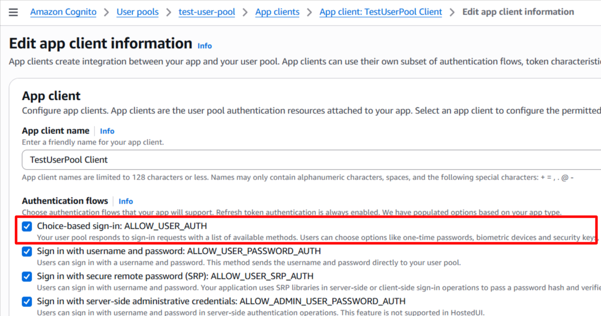
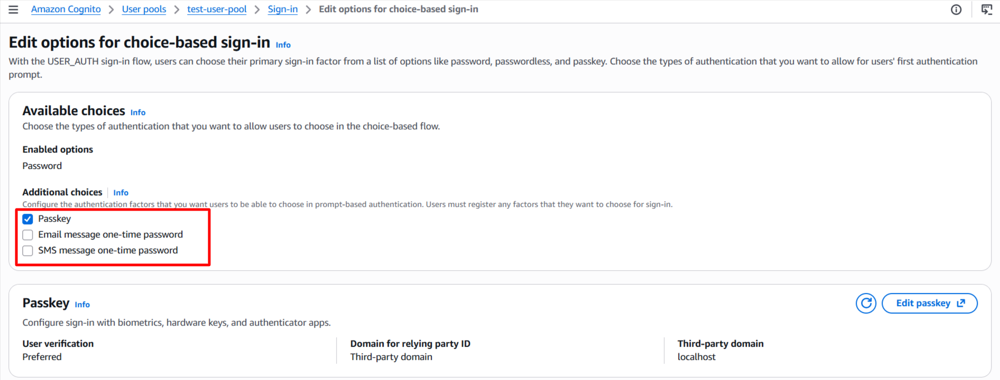
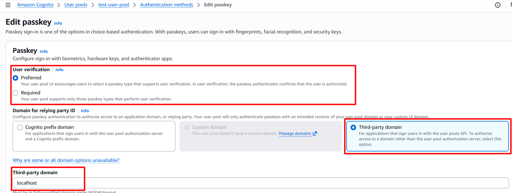
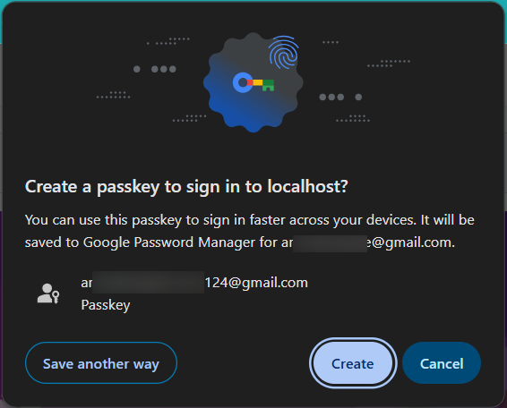
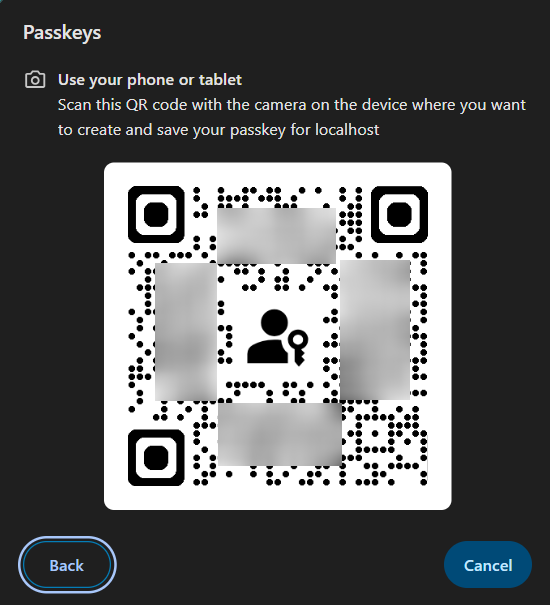

# FIDO2 Security OR Passkey Functionality (WebAuthn/EMail OTP/SMS OTP)

>[!IMPORTANT]
>We have released the **laravel blade components** as a feature from V2.0.6. These  component have php/html blade components and javascript functions to implement the FIDO2 Security Keys OR Passkey based functionality within your application. All FIDO2 Security features are supported.

## **Contents**
- [Introduction](#introduction)
- [Configurations](#configurations)
- [Features](#features)
- [API Routes](#api-routes)
- [References](#references)

## **Introduction**
This package feature provides the FIDO2 Security Keys OR Passkey based functionality. This is a passwordless authentication approach, where the user can use the security key or passkey to authenticate. 

This is a ***Zero-Knowledge Authentication*** method.
The approach uses a physical or a virtual device (i.e. laptop or mobile device). The passkey is a software-based certificate that is stored on the user's device and can be used for authentication.

The AWS Cognito currently provides following methods:
- EMAIL OTP
- SMS OTP
- Device based Biometric Authentication (i.e. Touch ID, Face ID)

## **Configurations**
- [AWS Configurations](#aws-configurations)
- [Laravel Package Configurations](#laravel-package-configurations)

### AWS Configurations
---
In order to use the FIDO2 Security Keys OR Passkey based functionality, you need to configure the AWS Cognito User Pool with the necessary settings.

#### Step 1: Select the App Client in the AWS Cognito User Pool


#### Step 2: Enable the FIDO2 Security Keys OR Passkey based MFA functionality in the Sign-in experience settings


AWS Cognito provides the FIDO2 Security Keys OR Passkey based functionality, with multiple choices. This data is dynamically provided from the trait making the user experience better.

#### Step 3: Set the Authentication flow settings for passkey based authentication


>[!IMPORTANT]
> During the development phase, you can set the server domain as localhost. 

This will be used as the relying party id for the FIDO2 Security Keys OR Passkey based authentication. However, in the production environment, you need to set the server domain as the domain name of your application. This is required for the FIDO2 Security Keys OR Passkey based authentication. The relying party id is used to identify the application during the authentication process.

### Laravel Package Configurations
---
This Laravel Package provides the necessary methods to implement this functionality and supports all types provided by AWS Cognito. The available challenges are dynamically provided from the trait making the user experience better.

The package provides a trait that you can add to your controller to make the passkey methods running.
- Ellaisys\Cognito\Auth\WebAuthPasskey

The methods provided in the trait are as follows:
- start
- complete
- challenge
- delete

The package also provides Controller methods that you can use to implement the FIDO2 Security Keys OR Passkey based MFA functionality. You can publish the controllers using the command below and then use the methods in your controller.
> php artisan vendor:publish --provider="Ellaisys\Cognito\Providers\AwsCognitoServiceProvider" --tag="controllers"

The name of the controller that is published is `WebAuthPasskeyController`. You can use the methods in this controller to implement the FIDO2 Security Keys OR Passkey based MFA functionality in your application. The controller uses the trait ***Ellaisys\Cognito\Auth\WebAuthPasskey***, which provides the necessary methods to implement this functionality in your application.


Also, configure below keys into the .env file to change the default setting. 
 - The **AWS_COGNITO_ALLOW_PASSKEYS** should be set to true to enable the passkey feature. The default value is false resulting into disabled passkey functionality. 
 - The **AWS_COGNITO_WEB_AUTHN_FACTOR_CONFIGURATION** can have values MULTI_FACTOR_WITH_USER_VERIFICATION (default) or SINGLE_FACTOR. More details are available in the configuration file with the key web_authn_mfa_configuration.
 - The **AWS_COGNITO_WEB_AUTHN_RELYING_PARTY_ID** is the domain name of the application. This is required for the FIDO2 Security Keys OR Passkey based MFA functionality. The default value is localhost.
 - The **AWS_COGNITO_WEB_AUTHN_USER_VERIFICATION_METHOD** can have values preferred (default), required or discouraged. More details are available in the configuration file with the key web_authn_mfa_configuration.

   The provider configuration aids to send out the SMS from AWS with additional costs. Refer AWS SNS pricing for more details [AWS SMS Pricing](https://aws.amazon.com/sns/sms-pricing/)

```php

    AWS_COGNITO_ALLOW_PASSKEYS=true

```

## **Features**
- [Passkey Registration](#passkey-registration-with-fido-authenticator)
- [Login (Passkey Enabled)](#login-with-passkey-functionality)

## **API Routes**
>[!IMPORTANT]
>We are releasing the API predefined routes as a new feature from V1.3.0.
>php artisan vendor:publish --provider="Ellaisys\Cognito\Providers\AwsCognitoServiceProvider" --tag="controllers"

For the list of published routes and configurations, please refer [API Routes](../docs/README_ROUTES.md#api-routes)

### **Passkey Registration with FIDO Authenticator**

#### Using the Blade Component
The package provides a blade component that you can use to implement the passkey registration functionality in your pages.
You can use the component in your blade files as shown below. The component has all the required scripts, routes and methods to implement the passkey registration functionality in your application. The component uses the WebAuthPasskey trait, which provides the necessary methods to implement this functionality in your application.

```blade
    ...
    @section('content')
        <x-cognito::common.js-scripts />
        <x-cognito::passkey-webauthn />

        ...
        ...

        @stack('cognito-common-scripts')
        @stack('cognito-passkey-webauthn-scripts')
    @endsection
    ...
```

You can also use simple html buttons or any element with the data attributes to trigger the passkey registration functionality as shown below. The component uses the WebAuthPasskey trait, which provides the necessary methods to implement this functionality in your application. The data attributes are used to trigger the necessary javascript functions to implement the passkey registration functionality in your application. The data attributes are as follows:
- data-role: This attribute is used to identify the element that will trigger the passkey registration functionality. The value of this attribute should be passkey-webauthn.
- data-action: This attribute is used to identify the action that will be performed when the element is clicked. The value of this attribute can be register or delete. The register value is used to trigger the passkey registration functionality and the delete value is used to trigger the passkey deletion functionality.

```html
    <button data-role="passkey-webauthn" data-action="register">
        Register Passkeys</button>

    <button type="button" data-role="passkey-webauthn" data-action="delete">
        Delete Passkeys</button>

```

Alternately, the package also provides API routes that you can use to implement the passkey registration functionality in your application. The API routes are as follows: The passkey registration process involves two steps.
1. The first step is to generate the registration certificate. The library provides a route that calls the start method in the WebAuthPasskey trait to generate the registration certificate. The response will be the registration certificate that can be used to register the passkey with the FIDO Authenticator (navigator.credentials.create).
```php

    public function start(Request $request)
    {
        ...
    } //Function ends

```

The response for the API call would look like this.
```json
    {
        "challenge": "yEAFH***********vfPIZwg",
        "rp": {
            "name": "Application Name",
            "id": "localhost"
        },
        "user": {
            "id": "YzA3M2Uw************************zMGYwN2Zk",
            "name": "johndoe",
            "displayName": "John Doe"
        },
        "pubKeyCredParams": [
            {
                "type": "public-key",
                "alg": -7
            },
            {
                "type": "public-key",
                "alg": -257
            }
        ],
        "timeout": 60000,
        "excludeCredentials": [
            {
                "type": "public-key",
                "id": "hu9Bl-y9fkczpQLT6X40Ww"
            },
            ...
            ...
            {
                "type": "public-key",
                "id": "WScmmw29ENmAC07cQP-kdw"
            }
        ],
        "authenticatorSelection": {
            "requireResidentKey": true,
            "residentKey": "required",
            "userVerification": "preferred"
        }
        ...
    }
```

Send this data to the java script function to register the passkey with the FIDO Authenticator (navigator.credentials.create). it should show a prompt to the user to register the passkey with the FIDO Authenticator. The user can then use the security key or passkey to authenticate.





2. The response from the FIDO Authenticator will be used in the second step to complete the registration process.
```php

    public function complete(Request $request)
    {
        ...
    } //Function ends

```
The response for the API call would look like this with the HTTP Status Code 200.
```json
    {
        "status": "success"
    }
```

### **Login with Passkey Functionality**

#### Using the Blade Component

The package provides a blade component that you can use to implement the passkey login functionality in your **challenge page**.

```html
    <form id="auth-challenge-form" method="POST" ...>
        ...
        <x-cognito::challenge
            :challenge-form-name="'auth-challenge-form'" /> <!-- Note the form name provided as a parameter to the component -->
        ...
        ...
        @php
            $data = (session('data')) ?? null;
            $challengeNameValue = 'NONE';

            if ($data && isset($data['status']) && $data['status'] == 'challenge') {
                $challengeNameValue = isset($data['challenge_name']) ?
                    strtoupper($data['challenge_name']) :
                    $challengeNameValue;
            } //End if
        @endphp
        ...
        ...
        <div> <!-- Shows the passcode input field for the Password/OTP/TOTP based challenges only  -->
            @stack('cognito-challenge-passcode')
        </div>
        ...
        ...
        <button type="submit"
            data-action="challenge-submit" data-role="{{ $challengeNameValue }}">
            Submit</button>
        ...
    </form>

    @stack('cognito-challenge-scripts')
    ...
```
Using this component will simplify the implementation of the passkey login functionality in your application. The data is secure on the client side and the necessary scripts and methods are provided in the component to implement the passkey login functionality in your application.

Alternately, you can also use your own logic and API calls to implement the passkey login functionality in your application. The package provides API routes that you can use to implement the passkey login functionality in your application.

The login shall require three steps for implementation of the overall authentication using the passkey approach. 
1. The first step shall generate the available challenges.
```php

    public function challenge(Request $request, ?string $challengeName = null)
    {
        ...
    } //Function ends

```

This API will return the available challenges for the user. The response will be as shown below. The challenge name shall be SELECT_CHALLENGE. This will also chow the available challenges for the user. 

The data in AvailableChallenges will be based on the configuration in the AWS Cognito User Pool and the user's settings. The user can then select the challenge and proceed with the authentication process. The available challenges will be dynamically provided from the trait making the user experience better. The user can then select the challenge and proceed with the authentication process. The available challenges will be dynamically provided from the trait making the user experience better.

```json
    {
        ...
        "ChallengeName": "SELECT_CHALLENGE",
        "Session":"AYABeEkKMeJKkzhx3MK-GzS3ISIAH
        QABAAdTZXJ2aWNlABBDb2duaXRvVXNlclBvb2xzAA
        ...
        ...
        jVrz53Y1uJ3I30w46CpL9xlB50IbVJ0SNYY_tuFsLc
        GjYfDpn7XQcd6-fXWovCIYoMH5Q",
        "AvailableChallenges": [
            "PASSWORD_SRP",
            "PASSWORD",
            "EMAIL_OTP",
            "SMS_OTP",
            "WEB_AUTHN"
        ],
        ...
    }
```

2. The second step involves generating the challenge based on the selected passkey choice with the session token.

The API endpoint is the same with additional parameter for the challenge name. The route provided allows the challenge name to be passed as a path parameter. The response will be the challenge for the selected passkey choice. The user can then use the security key or passkey to authenticate.

```php

    public function challenge(Request $request, ?string $challengeName = null)
    {
        ...
    } //Function ends

```

The request payload for the Web and API based route is as shown below.
```json
    {
        "challenge_name": "WEB_AUTHN",
        "username": "john@doe.com"
    }
```

The response for the API call would look like this with the HTTP Status Code 200. Based on the challenge name, the necessary data will be provided in the response. 

The data in **ChallengeParameters** will be based on the challengeName provided. The user can then use the security key or passkey to authenticate. The available challenges will be dynamically provided from the trait making the user experience better.
```json
    {
        "ChallengeName": "WEB_AUTHN",
        "Session":"AYABeEkKMeJKkzhx3MK-GzS3ISIAH
        QABAAdTZXJ2aWNlABBDb2duaXRvVXNlclBvb2xzAA
        ...
        ...
        jVrz53Y1uJ3I30w46CpL9xlB50IbVJ0SNYY_tuFsLc
        GjYfDpn7XQcd6-fXWovCIYoMH5Q",
        "AvailableChallenges": [
            "PASSWORD",
            ...
            "WEB_AUTHN"
        ],
        "ChallengeParameters": {
            "CREDENTIAL_REQUEST_OPTIONS": "json_string_of_credential_request_options"
        }
    }
```

3. The third step involves verifying the OTP/TOTP code OR biometric data.

The library provides the necessary views and methods to implement the login functionality in your application.

The challenge based login enpoint for Web and API based approach is provided. The same endpoint can be used for MFA challenges and FIDO2 authentication challenges.

We have used simple javascript to make the API calls for the login functionality. You can customize the views and the API calls as per your requirements and the choice of the frontend framework.

```php

    public function challenge(Request $request)
    {
        ...
    } //Function ends

```
The payload for the Web and API based route is as shown below. The request payload will depend on the challenge name provided in the previous step. The user can then use the security key or passkey to authenticate.

```json
    {
        "challenge_name": "WEB_AUTHN",
        "session": "AYABeEkKMeJKkzhx3MK-GzS3ISIAH
        QABAAdTZXJ2aWNlABBDb2duaXRvVXNlclBvb2xzAA
        ...
        ...
        jVrz53Y1uJ3I30w46CpL9xlB50IbVJ0SNYY_tuFsLc
        GjYfDpn7XQcd6-fXWovCIYoMH5Q",
        "challenge_response": "string_response",
        "username": "john@doe.com"
    }
```

The response for the API call would look like this with the HTTP Status Code 200. The response object will contain the access token, refresh token and the id token. The user can then use the access token to access the protected resources in the application. This is similar to the response received in the simple login process. The only difference is that the user can use the security key or passkey to authenticate.

