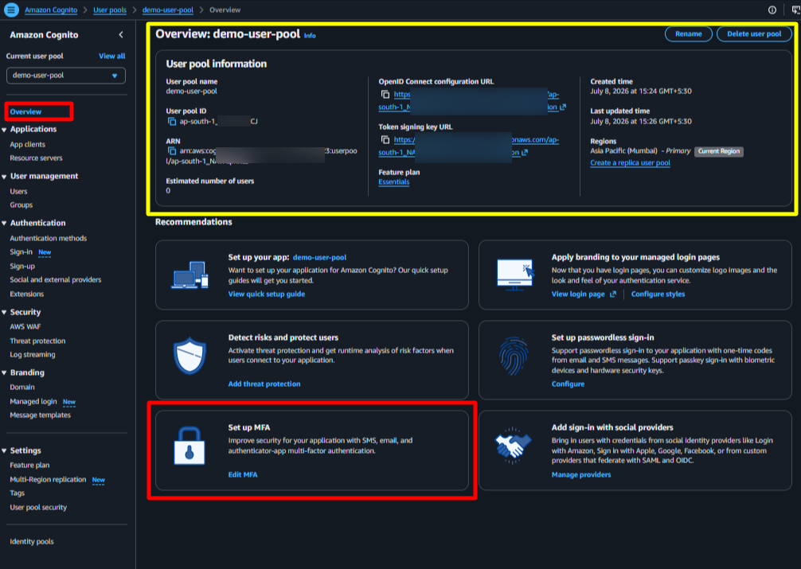
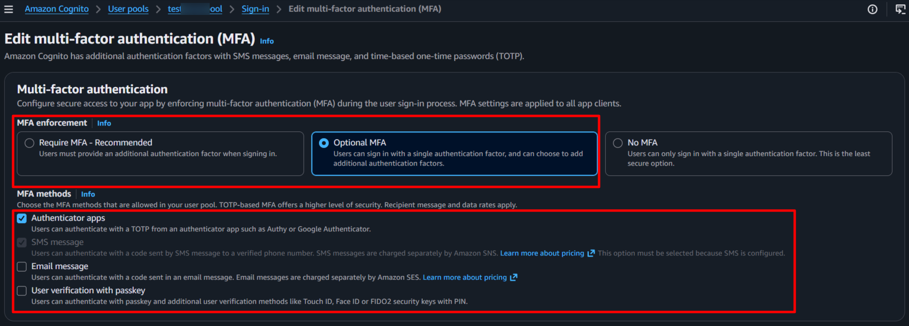
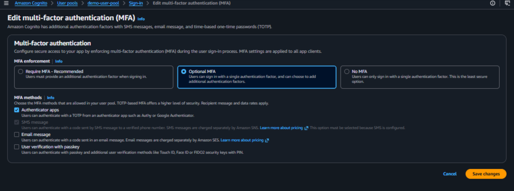
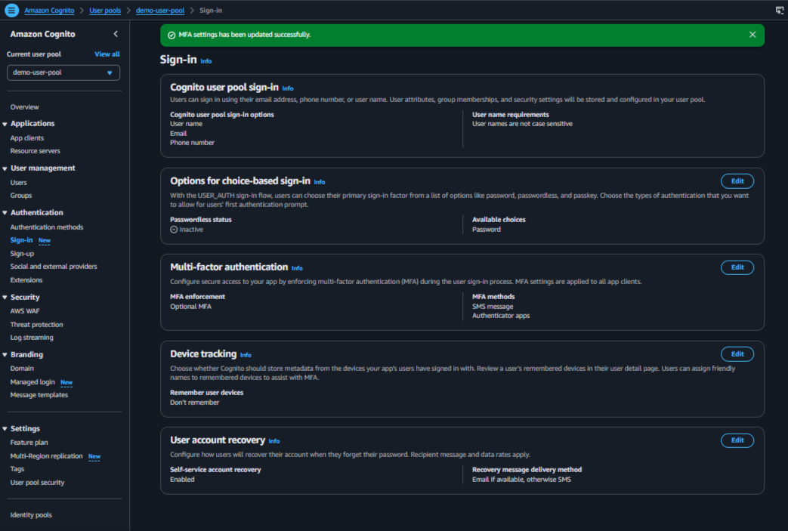
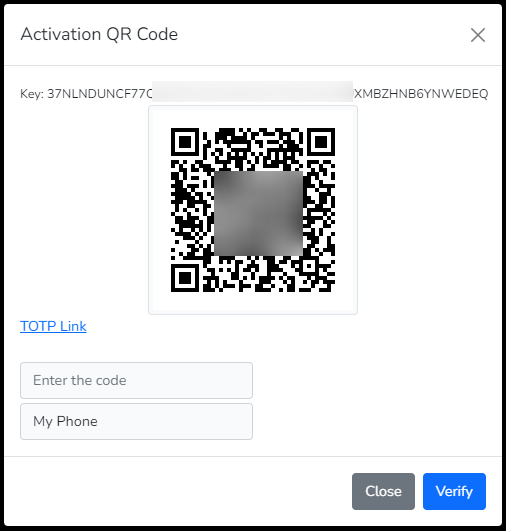

# **Multi-Factor Authentication (MFA)**

This package provides the Multi-Factor Authentication (MFA) functionality using AWS Cognito. This documentation provides the necessary information to implement the MFA functionality in your Laravel application.

> [!NOTE]
> Updated On 2026-07-10

> [!IMPORTANT]
> We have released the **laravel blade components** as a feature from V2.0.6. These view components have php/html blade code and javascript functions to handle MFA challenge verification within your application.


## **Contents**

- [Introduction](#introduction)
- [Configurations](#configurations)
- [Features](#features)
- Quick Start
    - [Blade Component](#blade-component-web-app)
- Advanced Topics
    - [API Documentation](#api-documentation)
    - [API Routes](#api-routes)
- [References](#references)
- [Key Points](#key-points)


## **Introduction**

Multi-Factor Authentication (MFA) is a security feature that adds an extra layer of protection to user accounts by requiring users to provide additional verification during the login process. This package provides support for MFA using AWS Cognito, allowing developers to implement MFA in their Laravel applications.

The library currently provides the MFA for the Software Token and SMS based TOPT.


## **Configurations**

- [AWS Configurations](#aws-configurations)
- [Laravel Configurations](#laravel-configurations)

### *AWS Configurations*
---

In order to use the MFA functionality, you need to configure the AWS Cognito User Pool with the necessary settings. Enable the **Multi-Factor Authentication (MFA)** option.

Select your AWS Cognito User Pool and navigate to the `Authentication` > `Sign-in`.

#### Step 1A: First time MFA configuration
Select `Overview` in the left navigation and browse to the `Set up MFA` section on the right panel. Click on the `Edit MFA` link to configure the MFA settings.



#### Step 1B: Amend the existing MFA configuration

If you have already configured the MFA settings, the above step 1A will not be available.

In that case, you can expand `Authentication` in the left navigation, and click the `Sign In` option. Then, browse to the `Multi-Factor Authentication (MFA)` section on the right panel. Click on the `Edit` link to configure the MFA settings, as shown below.



#### Step 2: Select the MFA enforcement and methods in the AWS Cognito User Pool


Select the desired enforcement and methods for MFA in the AWS Cognito User Pool. The available options are:

- MFA Enforcement
    + Required (forces all users to set up MFA)
    + Optional (allows users to choose whether to set up MFA)

- MFA Methods
    + Authenticator apps for `SOFTWARE_TOKEN_MFA`
    + SMS messages for `SMS_MFA`
    + Email Messages for `EMAIL_MFA` (not supported in this package)
    + User Passkeys
    
Save the changes.

#### Step 3: Confirmation of saved MFA settings


### *Laravel Configurations*
---

The package exposes following keys to change the default setting. These keys can be configured in the `.env` file or in the `config/aws-cognito.php` file. The default values are set in the configuration file.
 - The `AWS_COGNITO_MFA_SETUP` should be set to **MFA_ENABLED** to enable the MFA feature. The default value is MFA_NONE resulting into disabled MFA functionality. 
 - The `AWS_COGNITO_MFA_TYPE` can have values **SOFTWARE_TOKEN_MFA** (default) for the Software Token and **SMS_MFA** for the SMS based TOTP.

   The provider configuration aids to send out the SMS from AWS with additional costs. Refer AWS SNS pricing for more details [AWS SMS Pricing](https://aws.amazon.com/sns/sms-pricing/)

```php

    AWS_COGNITO_MFA_SETUP="MFA_ENABLED"
    AWS_COGNITO_MFA_TYPE="SOFTWARE_TOKEN_MFA"

```

## **Features**

- [Login (MFA Enabled)](#login-with-mfa)
- [Software Token MFA](#software-token-mfa-functionality)
    + [Activate MFA](#1-activate-mfa)
    + [Verify MFA Token](#2-verify-mfa)
    + [Deactivate MFA](#3-deactivate-mfa)
- [Enable MFA](#enable-mfa)
- [Disable MFA](#disable-mfa)

## **Blade Component** (web app)

The package provides a blade component for 
1. `MFA management`, and 
2. `MFA based authentication`

The MFA based authentication component is integrated into the `challenge` component.

### *MFA based Authentication*
---

Use the `challenge` component in your challenge page to handle the MFA authentication flow. The component will handle the generation of the necessary values for the MFA proof and will send them back to the server in response to the challenge.

```html
    <form id="auth-challenge-form" method="POST" ...>
        ...
        <!-- pass the form name provided as a parameter to the component -->
        <x-cognito::challenge
            :challenge-form-name="'auth-challenge-form'" />
        ...
        ...
        @php
            $data = (session('data')) ?? null;
            $challengeNameValue = 'NONE';

            if ($data && isset($data['status']) && $data['status'] == 'challenge') {
                $challengeNameValue = isset($data['challenge_name']) ?
                    strtoupper($data['challenge_name']) :
                    $challengeNameValue;
            } //End if
        @endphp
        ...
        ...
        <div> <!-- Shows the passcode input field for the Password/OTP/TOTP based challenges only  -->
            @stack('cognito-challenge-passcode')
        </div>
        ...
        ...
        <!-- Button with data-action and data-role attribute -->
        <button type="submit"
            data-action="challenge-submit" data-role="{{ $challengeNameValue }}">
            Submit</button>
        ...
    </form>

    @stack('cognito-challenge-scripts')
    ...
```

Using this component will simplify the implementation of the MFA authentication functionality in your application.

The data is **secure**, as per the cyber security standards, and the necessary scripts and methods are provided in the component to implement the MFA feature in your application.

## **API Documentation**

This Laravel Package provides the necessary methods to implement MFA based authentication functionality provided by AWS Cognito. The available challenges are dynamically provided from the trait making the user experience aligned to the AWS SDK.

The package provides a trait `RegisterMFA` that you can add to your controller to provide custom functionality. The namespace for the trait is `Ellaisys\Cognito\Auth\RegisterMFA`.

### *Login with MFA*
---

The login shall require two steps for complete the overall authentication using the MFA approach. 
1. Sign In using the username and password. This step shall generate the challenge.
2. The second step involves passing the OTP/TOTP `code` against that challenge.

#### <u>***Step 1***</u>: Sign In using username and password

```sh
POST /login
Content-Type: application/json
Accept: application/json
{
    "username": "<username>",
    "password": "<password>"
}
```

In case the MFA is enabled and activated, then the response will be as shown below. This example generates the challenge for the user to respond with the code from the authenticator application.

```json
{
    "status": "challenge",
    "challenge_name": "SOFTWARE_TOKEN_MFA",
    "session_token": "AYABeEkKMeJKkzhx3MK-GzS3ISIAH
    QABAAdTZXJ2aWNlABBDb2duaXRvVXNlclBvb2xzAA
    ...
    ...
    jVrz53Y1uJ3I30w46CpL9xlB50IbVJ0SNYY_tuFsLc
    GjYfDpn7XQcd6-fXWovCIYoMH5Q",
    "challenge_params": {
        "FRIENDLY_DEVICE_NAME": "<friendly_device_name>",
        "USER_ID_FOR_SRP": "<username>"
    },
    "username": "<username>"
}
```

#### <u>***Step 2***</u>: Respond to the challenge with the code from the authenticator application

```sh
POST /challenge
Content-Type: application/json
Accept: application/json
{
    "challenge_name": "SOFTWARE_TOKEN_MFA",
    "session": "<session_token_from_step_1>",
    "username": "<username>",
    "challenge_value": "<code_from_authenticator_app>"
}
```

### *Software Token MFA Functionality*
---

The Software Token MFA functionality allows users to enable and manage MFA using a software-based authenticator application. The package provides the necessary methods to activate, verify, and deactivate the Software Token MFA for users.

#### Activate MFA

The activate process allows the user to configure the Software MFA. To configure the Software Token MFA setting on the mobile device, a key or the scan code (easy to consume), is available for use on any of the authenticator applications (i.e. Google Authentictor OR Microsoft Authenticator).

The process completes when the code is verified using the [Verify MFA](#2-verify-mfa) step.

##### Web and API based Approach

The function call looks as shown below. Just reference the the method activateMFA, with the guard name as a parameter, in the trait that you added above in configuration. This shall activate the Software MFA token.

```php
public function actionActivate()
{
try {
        return $this->activateMFA('api'); //Pass the guard name for web/api calls
    } catch(Exception $e) {
        throw $e;
    } //Try-catch ends
} //Function ends
```
The response that you will get for the API call would look this

```json
{
    "SecretCode": "ESKPE46WBNOAB7QXXXXXXXXXXXXXXXXXXXPFIVJVJFEPDP2NNIA",
    "SecretCodeQR": "https://chart.googleapis.com/chart?chs=200x200&cht=qr&chl=otpauth://totp/ApplicationName (john@doe.com)?secret=ESKPE46WBNOAB7QXXXXXXXXXXXXXXXXXXXPFIVJVJFEPDP2NNIA&issuer=ApplicationName&choe=UTF-8",
    "TotpUri": "otpauth://totp/ApplicationName (john@doe.com)?secret=ESKPE46WBNOAB7QXXXXXXXXXXXXXXXXXXXPFIVJVJFEPDP2NNIA&issuer=ApplicationName"
}
```
and the web response, you can design a page like this to show the code for activating the Software MFA token.



>[!IMPORTANT]
>In case you want to change the QR Generator library, you can change the value in the configuration file with the key **mfa_qr_library**. Alternately, you can set the string in the environment file identified by **AWS_COGNITO_MFA_QR_LIBRARY**. 

#### Verify MFA

In order to complete the activation process, the verification is an essential step. As part of this verification process, you need to enter the code (available in the authenticator application) while submitting the request. The implementation needs to be updated depending on the web or API controller. The response will be HTTP Status Code 200.

```php
public function actionVerify(string $code)
{
try {
        return $this->verifyMFA('api', $code); //Pass the guard name for web/api calls and the MFA code from the device
    } catch(Exception $e) {
        throw $e;
    } //Try-catch ends
} //Function ends
```


#### Deactivate MFA

In order to deactivate the MFA for the authenticated user, this endpoint can be called to deactivate the MFA. In most practical situations, you can skip this implementation.

In order to enable/disable another user based on your RBAC implementation, you can use the [Enable](#enable-mfa) and [Disable](#disable-mfa) endpoints.

Below curl helps deactivate the user's MFA, returning the HTTP Success Code.

```sh
POST /user/mfa/deactivate
Content-Type: application/json
Accept: application/json
Authorization: Bearer <access_token>
```


### *Enable MFA*
---

This feature allows the user to enable MFA using an email address. The developer must implement the RBAC to ensure this feature is not misused.

Below curl helps enable the MFA returning the HTTP Success Code.

```sh
POST /user/mfa/enable
Content-Type: application/json
Accept: application/json
Authorization: Bearer <access_token>
{
    "username": "<username>"
}
```


### *Disable MFA*
---

This feature allows the user to disable MFA using an email address. The developer must implement the RBAC to ensure this feature is not misused.

Below curl helps disable the MFA returning the HTTP Success Code.

```sh
POST /user/mfa/disable
Content-Type: application/json
Accept: application/json
Authorization: Bearer <access_token>
{
    "username": "<username>"
}
```


## **API Routes**

> [!NOTE]
> We are releasing the API predefined routes as a new feature from V1.3.0.
>
> php artisan vendor:publish --provider="Ellaisys\Cognito\Providers\AwsCognitoServiceProvider" --tag="controllers"

For the list of published routes and configurations, please refer [API Routes](../docs/README_ROUTES.md#api-routes)


## **References**
- [AWS Cognito MFA](https://docs.aws.amazon.com/cognito/latest/developerguide/user-pool-settings-mfa.html)
