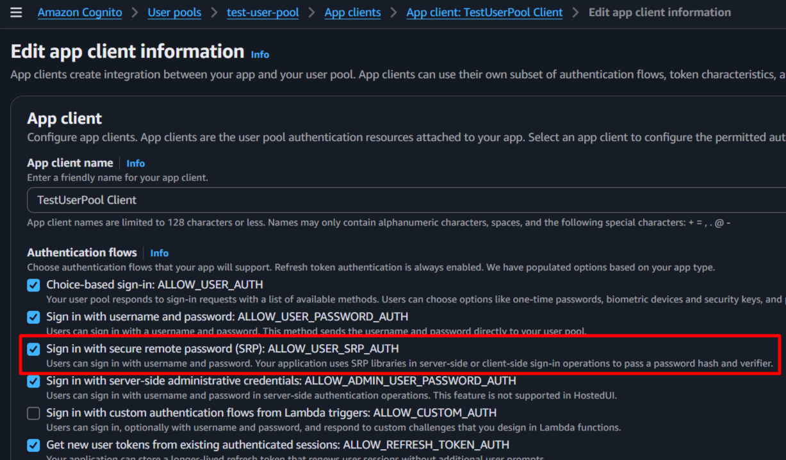

# **SRP (Secure Remote Password) Authentication**

## **Overview**

SRP is a secure authentication protocol that allows users to authenticate without transmitting their password over the network. Instead, the authentication process uses cryptographic operations based on the user's password. This document explains how you can use this in the context of AWS Cognito and Laravel package.

## **Configuration**

Ensure your AWS Cognito User Pool is configured to allow `USER_SRP_AUTH` as an authentication flow. For that go to your User Pool in AWS Console, navigate to "App clients", select your app client, and check the option for "SRP (Secure Remote Password) authentication flow **ALLOW_USER_SRP_AUTH**" as shown below:



## **SRP Authentication Flow**

For this package, a new service is provided **Ellaisys\Cognito\Services\AwsCognitoSrpService** which implements the SRP authentication flow. The flow consists of the following methods:
1. *generateEphemeral* - Generates the SRP_A value on the client side, along with the private ephemeral value 'a'.
2. *processChallenge* - Builds the response to the PASSWORD_VERIFIER challenge using the SRP_B, salt, and secret block received from the server.

### **Step 1: SRP_A Generation**

The package expects the client (browser/mobile app) to compute the SRP_A value before sending it to the server. This is a critical part of the SRP protocol, as it ensures that the actual password is never transmitted. However, for ease you can have the package compute SRP_A on the server side as well, but this is not recommended for security reasons.
**IMPORTANT: SRP_A is calculated BEFORE receiving the salt from the server.**

The SRP_A value is generated **on the client side** (browser/mobile app) using the following mathematical operation:

$$SRP\_A = g^a \bmod N$$

Where:
- **a** = A cryptographically secure random integer generated by the client
- **g** = Generator (provided by AWS Cognito)
- **N** = Large prime modulus (provided by AWS Cognito)
- **mod** = Modulo operation

### **Step 2: Initiate Authentication**

The client sends the following to the server:

```
POST /login/srp
Content-Type: application/json

{
  "username": "user@example.com",
  "srp_a": "<optional_computed_SRP_A_value>",
  "session_token": "<optional_computed_random_number>"
}
```

The `srp_a` field here contains the **pre-computed SRP_A value** (not the actual user password). if you choose not to compute SRP_A on the client side, you can omit this field and the package will compute it for you on the server side. 

However, for **higher security**, it is recommended to compute SRP_A on the client side and send it to the server. If you choose to compute the SRP_A value on the client side, make sure to use a secure random number generator for calculating the private ephemeral value `a` as per the SRP protocol specifications.

Store the random number `a` securely on the client side (e.g., in memory) and do not transmit it to the server. Share a unique session token (e.g., a UUID) with the server so that responses from the server can be correlated with the correct authentication session. This session value is can be used to recover the private ephemeral value `a` on the client side when processing the server's challenge response in the next step.

### **Step 3: Server-Side Processing**

The server receives the request and calls AWS Cognito's endpoint. AWS Cognito processes the SRP_A value and responds with a challenge that includes the following parameters:

AWS Cognito responds with:
- **SRP_B**: Server's SRP value
- **Salt**: Used in password hashing
- **SecretBlock**: Encrypted information from the server
- **UserIdForSrp**: User identifier for SRP calculations
- **Session**: Session token for the ongoing authentication process
- **ChallengeName**: Typically "PASSWORD_VERIFIER" indicating the next step in the authentication process

### **Step 4: Password Proof Calculation**

Generate the password hash (with SHA256 encryption) using the pool name (without region), username and the user's password. You can use the following formula to calculate the password proof:

```javascript

    // Set the actual password value in the hidden challenge value input
    let passKey = atob(poolName) + username+ ':' + password;

    // Hash with SHA256 and set the hashed value in the challenge value input
    let passKeyHash = await hashEncrypt(passKey, 'SHA-256');
```

Send that value back to the server in response to the challenge with **PASSKEY_HASH** as the key.

### **Step 5: Respond to the Auth Challenge**

The client sends the following to the server:

```
POST /login/auth-challenge
Content-Type: application/json

{
  "challenge_name": "PASSWORD_VERIFIER",
  "session": "<session_token_as_private_ephemeral_value_a>",
  "username": "<username_for_srp>",
  "challenge_value": "<computed_challenge_value>"
}
```

The `challenge_value` field contains the stringified JSON object with the following structure. Do not change the keys or the case as they are expected by the server for calculating the **PASSWORD_CLAIM_SIGNATURE** and authenticating the user:

```
{
  "SALT": "<salt_from_step-2>",
  "SECRET_BLOCK": "<secret_block_from_step-2>",
  "SRP_B": "<SRP_B_from_step-2>",
  "USER_ID_FOR_SRP": "<username_for_srp_from_step-2>",
  "PASSKEY_HASH": "<computed_password_proof_hash>"
}
```

The server side, the package will process this challenge response and call AWS Cognito's endpoint to verify the password proof. If the proof is correct, AWS Cognito will authenticate the user and return an authentication token.

## **Key Points:**
- **Phase 1 (calculateSrpA)**: Uses only `N` and `g`. Generates a random `a`. NO password, username, or salt needed.
- **Phase 2 (calculatePasswordProof)**: Uses `salt`, `password`, and `username` received from server
- **a** must be generated using cryptographically secure random number generator
- **N** and **g** are negotiated during the initial handshake with AWS Cognito
- The values must be converted to appropriate formats (hex, base64) for transmission
- SRP_A is typically a very large number (1024-bit to 2048-bit range)

## **Understanding SRP Parameters: N and g**

### **What is N (Modulus)?**

**N** is a very large **prime number** used in the SRP protocol:
- **Bit Size**: Typically 1024-bit or 2048-bit (AWS Cognito uses 1024-bit)
- **Purpose**: Defines the size of the SRP group and ensures security
- **Used in**: The modular exponentiation formula: **SRP_A = g^a mod N**
- **Fixed Value**: The same N is used for all authentications in a given Cognito User Pool

Example (simplified):
```
N = 2^1024 - 2^960 - 1 + 2^64 * floor(2^894 * pi + 129093)
```

### **What is g (Generator)?**

**g** is a small **generator** (primitive root) of the multiplicative group modulo N:
- **Typical Value**: Usually **2** or **5**
- **Purpose**: Used to generate SRP_A and SRP_B values
- **Used in**: The modular exponentiation with random integers
- **Fixed Value**: Same g is used for all authentications in a given system

Example:
```
g = 2
```

### **How to Obtain N and g**

In AWS Cognito SRP authentication, **N and g are provided by the Cognito server** automatically. However, you don't need to **manually fetch or calculate N and g** - the library handles this automatically!

### **SRP Group Standards**

**RFC 2409 - SRP Group 1 (1024-bit):**
```
N = 2^1024 - 2^960 - 1 + 2^64 * floor(2^894 * pi + 129093)
g = 2
```

**RFC 3526 - SRP Group 14 (2048-bit):**
```
N = 2^2048 - 2^1984 - 1 + 2^64 * floor(2^1918 * pi + 124476)
g = 2
```

AWS Cognito typically uses **RFC 2409 (1024-bit) with g=2**.

### **Parameter Summary Table**

| Parameter | What It Is | Where It Comes From | Typical Size | Used In |
|-----------|-----------|-------------------|--------------|---------|
| **N** | Large prime modulus | AWS Cognito server | 1024 or 2048 bits | Modulo operation |
| **g** | Generator (primitive root) | AWS Cognito server | Small integer (2 or 5) | Exponentiation |
| **a** | Secret random integer | Generated by client | 128-256 bits | SRP_A calculation |
| **SRP_A** | g^a mod N | Calculated by client | Same as N (1024 or 2048 bits) | Sent to server |

### **Why These Parameters Matter**

1. **Security**: Larger N (2048-bit) provides better security than smaller N (1024-bit)
2. **Authentication**: Different N and g values define different SRP groups; both parties must use the same group
3. **Performance**: Larger N means longer calculation time for modular exponentiation
4. **Standardization**: RFC standards ensure interoperability between different implementations


## **References**

- [AWS Cognito Authentication Flow Documentation](https://docs.aws.amazon.com/cognito-user-identity-pools/latest/APIReference/API_AdminInitiateAuth.html)
- [SRP Protocol Specification (RFC 2945)](https://tools.ietf.org/html/rfc2945)
- [SRP Protocol Version 6 (RFC 5054)](https://tools.ietf.org/html/rfc5054)
- [Amazon Cognito Identity JS GitHub](https://github.com/aws-amplify/amplify-js/tree/main/packages/amazon-cognito-identity-js)

