# Admin Operations Flow – Sequence Diagram

Documents administrative user-management interactions (create, update, disable/enable, delete, group
management, and force password reset) performed via `AdminActions`/`AwsCognitoClient` using
`Admin*` Cognito Identity Provider APIs, which require IAM-authorized backend calls (not end-user tokens).

```mermaid
sequenceDiagram
    autonumber
    actor Admin
    participant Route as Laravel Route<br/>(admin middleware)
    participant Controller as AdminController<br/>(AdminActions trait)
    participant Validator as Request Validator
    participant CognitoClient as AwsCognitoClient<br/>(Service)
    participant AWS as AWS Cognito<br/>Identity Provider (Admin APIs)
    participant Store as Storage<br/>(Cache/Session/DB)

    rect rgb(235,245,255)
    note over Admin,Store: Admin Create User
    Admin->>Route: POST /admin/users {email, temp_password, attributes}
    Route->>Controller: createUser(Request)
    Controller->>Validator: validate(email unique, attributes rules)
    alt validation fails
        Validator-->>Controller: ValidationException
        Controller-->>Admin: 422 Unprocessable Entity
    else validation passes
        Controller->>CognitoClient: adminCreateUser(attributes, tempPassword)
        CognitoClient->>AWS: AdminCreateUser
        alt user already exists
            AWS-->>CognitoClient: UsernameExistsException
            CognitoClient-->>Controller: throw AwsCognitoException
            Controller-->>Admin: 409 Conflict
        else success
            AWS-->>CognitoClient: User (status=FORCE_CHANGE_PASSWORD)
            CognitoClient->>Store: persist local user record
            CognitoClient-->>Controller: created user
            Controller-->>Admin: 201 Created {user}
        end
    end
    end

    rect rgb(235,255,240)
    note over Admin,Store: Admin Update User Attributes
    Admin->>Route: PATCH /admin/users/{username} {attributes}
    Route->>Controller: updateUserAttributes(Request, username)
    Controller->>Validator: validate(attributes schema)
    alt validation fails
        Validator-->>Controller: ValidationException
        Controller-->>Admin: 422 Unprocessable Entity
    else validation passes
        Controller->>CognitoClient: adminUpdateUserAttributes(username, attributes)
        CognitoClient->>AWS: AdminUpdateUserAttributes
        alt user not found
            AWS-->>CognitoClient: UserNotFoundException
            CognitoClient-->>Controller: throw NoLocalUserException
            Controller-->>Admin: 404 Not Found
        else success
            AWS-->>CognitoClient: ack
            CognitoClient->>Store: sync local attributes
            CognitoClient-->>Controller: success
            Controller-->>Admin: 200 {attributes_updated}
        end
    end
    end

    rect rgb(255,250,235)
    note over Admin,Store: Admin Disable / Enable User
    Admin->>Route: POST /admin/users/{username}/disable
    Route->>Controller: disableUser(Request, username)
    Controller->>CognitoClient: adminDisableUser(username)
    CognitoClient->>AWS: AdminDisableUser
    alt user not found
        AWS-->>CognitoClient: UserNotFoundException
        CognitoClient-->>Controller: throw NoLocalUserException
        Controller-->>Admin: 404 Not Found
    else success
        AWS-->>CognitoClient: ack
        CognitoClient->>Store: purge cached tokens for user
        CognitoClient-->>Controller: success
        Controller-->>Admin: 200 {user_disabled}
    end

    Admin->>Route: POST /admin/users/{username}/enable
    Route->>Controller: enableUser(Request, username)
    Controller->>CognitoClient: adminEnableUser(username)
    CognitoClient->>AWS: AdminEnableUser
    AWS-->>CognitoClient: ack
    CognitoClient-->>Controller: success
    Controller-->>Admin: 200 {user_enabled}
    end

    rect rgb(245,235,255)
    note over Admin,Store: Admin Force Password Reset
    Admin->>Route: POST /admin/users/{username}/reset-password
    Route->>Controller: adminResetPassword(Request, username)
    Controller->>CognitoClient: adminResetUserPassword(username)
    CognitoClient->>AWS: AdminResetUserPassword
    alt user not found
        AWS-->>CognitoClient: UserNotFoundException
        CognitoClient-->>Controller: throw NoLocalUserException
        Controller-->>Admin: 404 Not Found
    else success
        AWS-->>CognitoClient: ack (status=RESET_REQUIRED)
        CognitoClient->>Store: flag user password_reset_required
        CognitoClient-->>Controller: success
        Controller-->>Admin: 200 {password_reset_initiated}
    end
    end

    rect rgb(250,240,255)
    note over Admin,Store: Admin Add/Remove User to Group
    Admin->>Route: POST /admin/users/{username}/groups {group_name}
    Route->>Controller: addUserToGroup(Request, username)
    Controller->>Validator: validate(group_name exists)
    alt validation fails
        Validator-->>Controller: ValidationException
        Controller-->>Admin: 422 Unprocessable Entity
    else validation passes
        Controller->>CognitoClient: adminAddUserToGroup(username, groupName)
        CognitoClient->>AWS: AdminAddUserToGroup
        alt group/user not found
            AWS-->>CognitoClient: ResourceNotFoundException
            CognitoClient-->>Controller: throw AwsCognitoException
            Controller-->>Admin: 404 Not Found
        else success
            AWS-->>CognitoClient: ack
            CognitoClient->>Store: sync local role/group mapping
            CognitoClient-->>Controller: success
            Controller-->>Admin: 200 {group_assigned}
        end
    end

    Admin->>Route: DELETE /admin/users/{username}/groups/{group_name}
    Route->>Controller: removeUserFromGroup(Request, username, group_name)
    Controller->>CognitoClient: adminRemoveUserFromGroup(username, groupName)
    CognitoClient->>AWS: AdminRemoveUserFromGroup
    AWS-->>CognitoClient: ack
    CognitoClient->>Store: sync local role/group mapping
    Controller-->>Admin: 200 {group_removed}
    end

    rect rgb(255,235,235)
    note over Admin,Store: Admin Delete User
    Admin->>Route: DELETE /admin/users/{username}
    Route->>Controller: deleteUser(Request, username)
    Controller->>Validator: validate(confirmation flag = true)
    alt validation fails (no confirmation)
        Validator-->>Controller: ValidationException
        Controller-->>Admin: 422 Unprocessable Entity
    else validation passes
        Controller->>CognitoClient: adminDeleteUser(username)
        CognitoClient->>AWS: AdminDeleteUser
        alt user not found
            AWS-->>CognitoClient: UserNotFoundException
            CognitoClient-->>Controller: throw NoLocalUserException
            Controller-->>Admin: 404 Not Found
        else success
            AWS-->>CognitoClient: ack
            CognitoClient->>Store: delete local user record + cached tokens
            CognitoClient-->>Controller: success
            Controller-->>Admin: 200 {user_deleted}
        end
    end
    end
```

## Notes

- **Validation** includes both request-shape rules and an explicit confirmation flag for destructive operations
  (e.g., delete user) as an approval safeguard.
- **Approval step**: Admin routes are protected by an `admin` middleware/guard (IAM-backed), ensuring only
  authorized backend/admin identities can invoke `Admin*` Cognito APIs — this is a structural approval gate
  distinct from end-user authentication.
- **Error handling** maps `UserNotFoundException`/`ResourceNotFoundException` to 404, `UsernameExistsException`
  to 409, and validation issues to 422, keeping AWS SDK exceptions abstracted behind package exceptions.
- **Data store** is kept in sync with Cognito state changes (disable/enable, group membership, deletion) to
  support fast local authorization checks without repeated AWS calls.