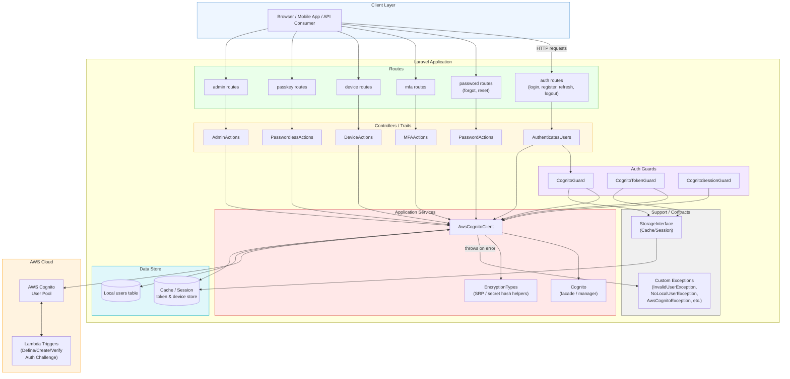
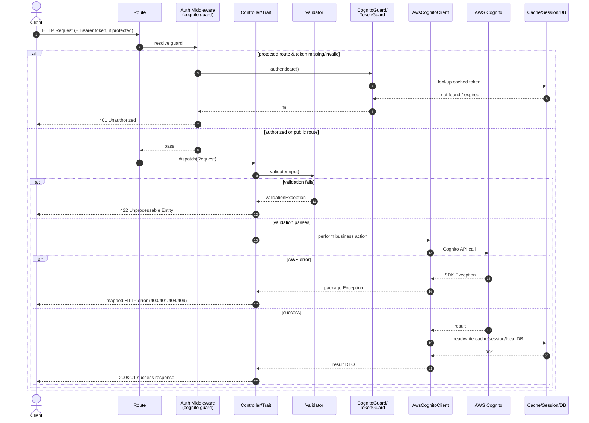

# Overall Architecture – Component & Flow Diagram

This diagram shows the high-level architecture of the `ellaisys/aws-cognito` Laravel package: how HTTP
requests flow through routes, controllers/traits, guards, the core service, and out to AWS Cognito and
local storage — tying together the individual flows documented in this folder.

## Component Diagram

## Request Lifecycle Sequence (Cross-Cutting)

A simplified, cross-cutting view of how a typical authenticated request flows through the layers,
independent of the specific feature (login, MFA, device, passkey, admin).

## Notes

- **Routes** are grouped by feature (auth, password, MFA, device, passkey, admin) and map to controller
  methods that use the package's auth traits.
- **Controllers/Traits** handle HTTP concerns (validation, response shaping) and delegate all Cognito
  interaction to the **`AwsCognitoClient`** service — the single integration point with AWS.
- **Guards** (`CognitoGuard`, `CognitoTokenGuard`, `CognitoSessionGuard`) plug into Laravel's auth system to
  resolve the authenticated user from a token/session, backed by the storage layer.
- **AwsCognitoClient** wraps the AWS SDK's `CognitoIdentityProvider` client, handles SRP/secret-hash
  computations via `EncryptionTypes`, and translates AWS SDK exceptions into package-specific exceptions.
- **Data Store** spans the local `users` table (mirrors Cognito user records) and cache/session storage
  (access/refresh tokens, device metadata, MFA/passkey challenge state).
- **AWS Cognito** is the identity source of truth, with optional **Lambda triggers** enabling advanced flows
  like custom-auth-based passwordless/passkey login.
- Individual feature flows (login, registration, MFA, devices, passkeys, admin ops) are detailed in their
  respective files in this `docs/flows` folder; this document ties them together at the architecture level.