# Authentication Flow – Sequence Diagram

This diagram documents the interaction between Laravel routes, controllers (using the package's auth traits),
the `AwsCognitoClient` application service, AWS Cognito, and the local data store (cache/session/DB) used for
token and user-attribute persistence.

```mermaid
sequenceDiagram
    autonumber
    actor Client
    participant Route as Laravel Route
    participant Controller as AuthController<br/>(AuthenticatesUsers trait)
    participant Validator as Request Validator
    participant CognitoClient as AwsCognitoClient<br/>(Service)
    participant CognitoGuard as CognitoGuard /<br/>CognitoTokenGuard
    participant AWS as AWS Cognito<br/>Identity Provider
    participant Store as Storage<br/>(Cache/Session/DB)

    rect rgb(235,245,255)
    note over Client,Store: Login Flow
    Client->>Route: POST /login {email, password}
    Route->>Controller: login(Request)
    Controller->>Validator: validate(email, password)
    alt validation fails
        Validator-->>Controller: ValidationException
        Controller-->>Client: 422 Unprocessable Entity
    else validation passes
        Controller->>CognitoClient: authenticate(credentials)
        CognitoClient->>AWS: InitiateAuth (USER_PASSWORD_AUTH)
        alt AWS returns challenge
            AWS-->>CognitoClient: ChallengeName + Session
            CognitoClient-->>Controller: ChallengeException
            Controller-->>Client: 200 {challenge_name, session}
        else invalid credentials
            AWS-->>CognitoClient: NotAuthorizedException
            CognitoClient-->>Controller: throw InvalidUserException
            Controller-->>Client: 401 Unauthorized
        else success
            AWS-->>CognitoClient: AuthenticationResult
            CognitoClient->>CognitoGuard: setToken(AccessToken)
            CognitoGuard->>Store: cache token/session
            CognitoClient-->>Controller: tokens
            Controller-->>Client: 200 {access_token, id_token, refresh_token}
        end
    end
    end

    rect rgb(235,255,240)
    note over Client,Store: Registration Flow
    Client->>Route: POST /register
    Route->>Controller: register(Request)
    Controller->>Validator: validate(unique, password rules)
    alt validation fails
        Validator-->>Controller: ValidationException
        Controller-->>Client: 422 Unprocessable Entity
    else validation passes
        Controller->>CognitoClient: createUser(attributes)
        CognitoClient->>AWS: AdminCreateUser / SignUp
        alt already exists
            AWS-->>CognitoClient: UsernameExistsException
            CognitoClient-->>Controller: throw AwsCognitoException
            Controller-->>Client: 409 Conflict
        else success
            AWS-->>CognitoClient: UserSub
            CognitoClient->>Store: persist local user
            CognitoClient-->>Controller: created user
            Controller-->>Client: 201 Created
        end
    end
    end

    rect rgb(255,250,235)
    note over Client,Store: Forgot / Reset Password Flow
    Client->>Route: POST /password/forgot
    Route->>Controller: sendResetLinkEmail(Request)
    Controller->>CognitoClient: forgotPassword(email)
    CognitoClient->>AWS: ForgotPassword
    alt user not found
        AWS-->>CognitoClient: UserNotFoundException
        CognitoClient-->>Controller: throw NoLocalUserException
        Controller-->>Client: 404 Not Found
    else success
        AWS-->>CognitoClient: CodeDeliveryDetails
        Controller-->>Client: 200 {code sent}
    end

    Client->>Route: POST /password/reset
    Route->>Controller: reset(Request)
    Controller->>Validator: validate(code, password confirmed)
    Controller->>CognitoClient: confirmPassword(email, code, password)
    CognitoClient->>AWS: ConfirmForgotPassword
    alt invalid/expired code
        AWS-->>CognitoClient: CodeMismatchException
        CognitoClient-->>Controller: throw InvalidUserFieldException
        Controller-->>Client: 400 Bad Request
    else success
        AWS-->>CognitoClient: ack
        CognitoClient->>Store: invalidate cached tokens
        Controller-->>Client: 200 {password reset}
    end
    end

    rect rgb(245,235,255)
    note over Client,Store: Refresh Token Flow
    Client->>Route: POST /token/refresh
    Route->>Controller: refresh(Request)
    Controller->>CognitoClient: refreshToken(refresh_token)
    CognitoClient->>AWS: InitiateAuth (REFRESH_TOKEN_AUTH)
    alt invalid/expired
        AWS-->>CognitoClient: NotAuthorizedException
        CognitoClient-->>Controller: throw InvalidUserException
        Controller-->>Client: 401 Unauthorized
    else success
        AWS-->>CognitoClient: New tokens
        CognitoClient->>CognitoGuard: setToken(newAccessToken)
        CognitoGuard->>Store: update cached token
        Controller-->>Client: 200 {access_token, id_token}
    end
    end

    rect rgb(255,235,235)
    note over Client,Store: Logout Flow
    Client->>Route: POST /logout
    Route->>Controller: logout(Request)
    Controller->>CognitoGuard: user()
    CognitoGuard->>Store: fetch cached token
    alt no active session
        CognitoGuard-->>Controller: null
        Controller-->>Client: 401 Unauthorized
    else active session
        Controller->>CognitoClient: signOut(accessToken)
        CognitoClient->>AWS: GlobalSignOut
        CognitoClient->>Store: purge cached token
        Controller-->>Client: 200 {logged out}
    end
    end
```

## Notes

- **Validation** occurs at the controller boundary before calling `AwsCognitoClient`.
- **Challenge/Approval steps** (MFA, NEW_PASSWORD_REQUIRED) are returned to the client for follow-up.
- **Error handling** maps AWS SDK exceptions into package-specific exceptions and HTTP status codes.
- **Data store** covers both cache/session token storage and local `users` table sync.