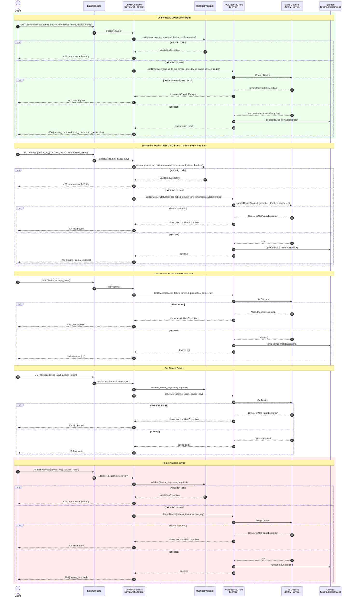

# Device Actions Flow – Sequence Diagram

Documents device tracking/remembering interactions using the `DeviceActions` trait, `AwsCognitoClient`,
and AWS Cognito (list, remember/forget, update status, and confirm device operations).

## Notes

- **Validation** ensures `device_key`/`device_group_key` are present and correctly formatted before AWS calls.
- **Approval step**: `ConfirmDevice` response's `UserConfirmationNecessary` flag gates whether the client must
  additionally prompt the user to confirm the device (e.g., via email/SMS).
- **Error handling** distinguishes not-found devices (404), invalid/expired tokens (401), and bad input (422/400).
- **Data store** caches device metadata and remembered status locally to reduce repeated `ListDevices`/`GetDevice` calls.