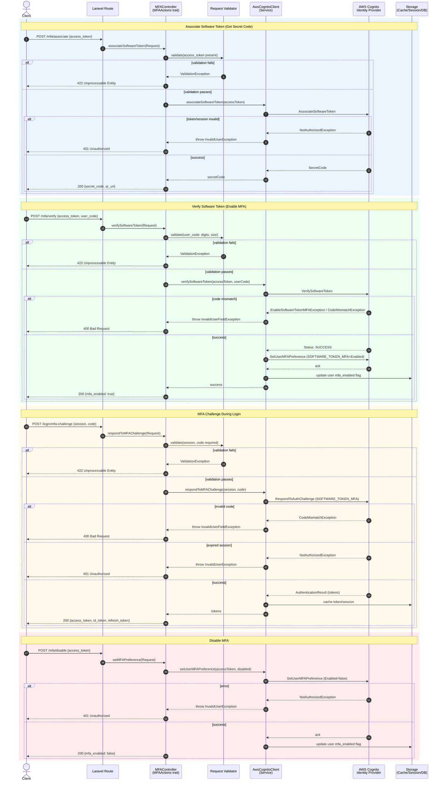

# MFA Setup Flow – Sequence Diagram

Documents the interaction for enabling, verifying, and challenging Multi-Factor Authentication
(Software Token / SMS MFA) using the `MFAActions` trait, `AwsCognitoClient`, and AWS Cognito.

## Notes

- **Validation** ensures `user_code` follows the TOTP format (6 digits) before hitting AWS.
- **Approval step**: `VerifySoftwareToken` returning `SUCCESS` acts as the approval gate before enabling MFA preference.
- **Error handling**: distinguishes between code mismatch (400) and session/token issues (401).
- **Data store** tracks the local `mfa_enabled` flag to avoid unnecessary AWS calls on subsequent checks.