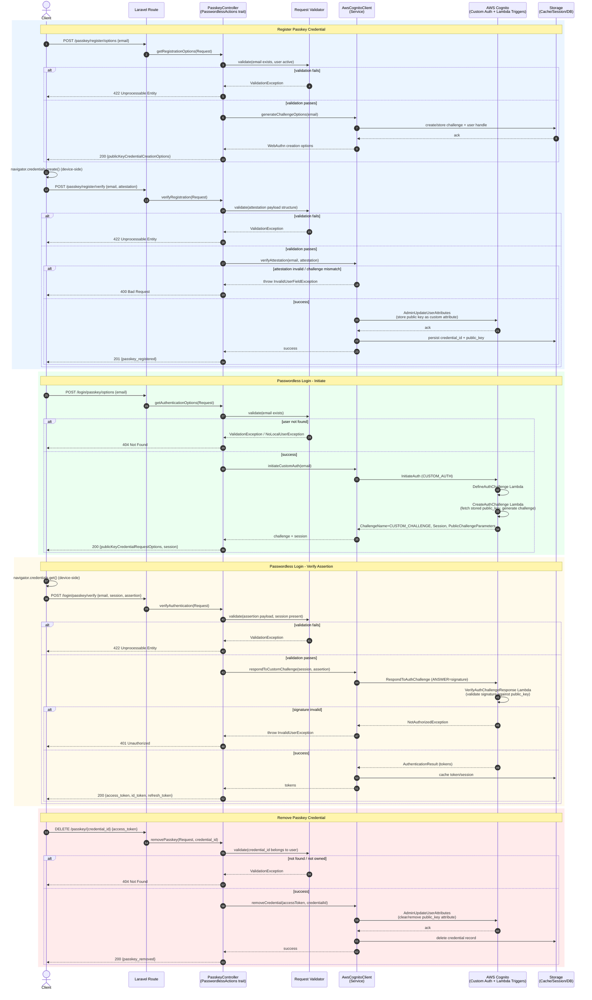

# Passkeys / Passwordless Flow – Sequence Diagram

Documents passwordless/passkey (WebAuthn / custom-auth-challenge based) authentication interactions,
covering registration of a passkey credential and authentication using it via Cognito's custom auth flow.

> Note: AWS Cognito does not natively support WebAuthn passkeys as of this writing; this flow models the
> package's `CUSTOM_AUTH` challenge-based approach commonly used to implement passwordless/passkey login,
> where a Lambda trigger (Define/Create/Verify Auth Challenge) validates the passkey assertion.

## Notes

- **Validation** covers presence/shape of WebAuthn attestation and assertion payloads before calling AWS/Lambda.
- **Approval step**: attestation/signature verification (via Lambda triggers `CreateAuthChallenge` /
  `VerifyAuthChallengeResponse`) acts as the cryptographic approval gate — no password is ever transmitted.
- **Error handling** separates client input errors (422/400/404) from authentication failures (401) when a
  signature or challenge fails verification.
- **Data store** persists challenge nonces (short-lived) and long-lived credential public keys tied to the user.